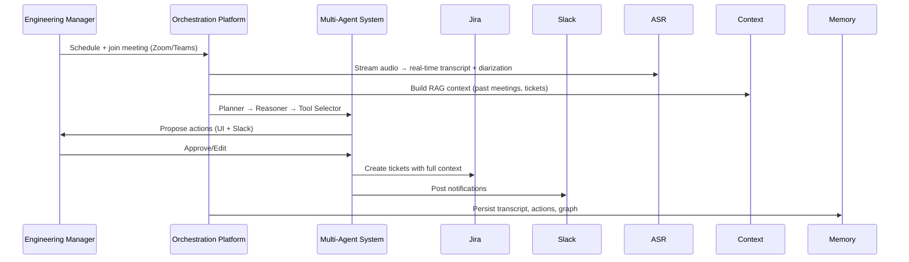
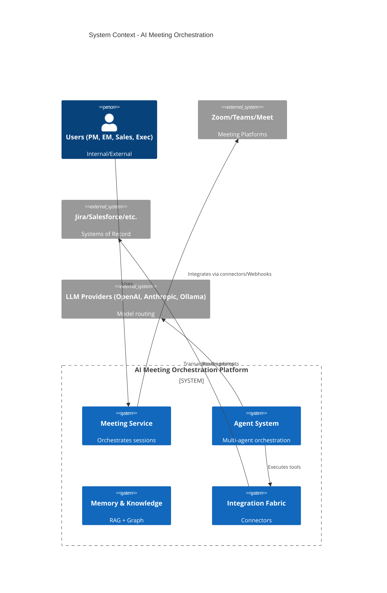
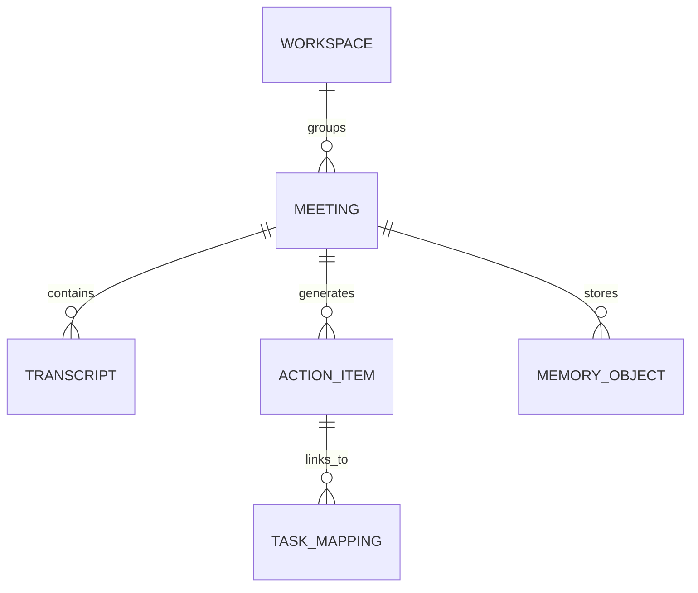

**Technical Implementation Blueprint: AI Meeting Orchestration Platform**

**Version:** 1.0  
**Date:** July 2026  
**Authors:** Distinguished Chief Systems Architect, Enterprise Solution Architect, Principal Product Architect, Staff Software Engineer, AI Systems Architect, Platform Architect, Security Architect, Data Architect, DevOps Architect, Technical Program Manager, Enterprise Technical Writer  

---

### 1. Executive Summary

The AI Meeting Orchestration Platform is a cloud-native, multi-tenant enterprise SaaS solution that transforms meetings from conversation generators into execution engines. It ingests voice from Zoom, Microsoft Teams, Google Meet, native clients, or phone bridges; performs real-time ASR with diarization; builds rich context via RAG and knowledge graphs; deploys multi-agent systems for reasoning, planning, and tool execution; and drives transactional updates into Jira, Salesforce, HubSpot, GitHub, Azure DevOps, Notion, Confluence, Slack, and internal systems under strict human-in-the-loop governance.

**Core Differentiators** (preserved and deepened):

- Agentic orchestration beyond transcription/summarization.
- Vendor-neutral multi-LLM routing (OpenAI, Anthropic, local/Ollama models).
- Strong enterprise governance, audit, RBAC, data residency, and approvals.
- Horizontal integration fabric across PM, CRM, code, and knowledge tools.
- Memory layers spanning meetings, workspaces, and tenants.

**Partners**:

- OpenAI (primary LLM).
- Wispr Flow (dictation).
- ElevenLabs (voice synthesis/output).
- Convex (real-time database).
- Linkup (web search).
- Dodo Payments (checkout).
- Cloudflare (hosting, edge, security).
- Hermes (assumed integration layer or messaging; to be validated).

**Target Timeline**: MVP in 4-6 months, GA in 9-12 months, Enterprise/Marketplace in 12-18 months.

**North Star Metric**: Meeting-to-Action Completion Rate (>90% within 30 days).

This blueprint expands the provided notes into implementable architecture, preserving every idea while adding production-grade detail, diagrams, service catalogs, schemas, and execution plans.

---

### 2. Vision & Product Mission

**Vision Statement** (preserved): Turn every meeting into a reliable execution engine.

**Mission**: Deliver governed, agentic workflows that automatically convert spoken decisions into verifiable actions across enterprise systems while maintaining full auditability, human oversight, and organizational memory.

**Strategic Positioning**: Horizontal AI orchestration layer sitting between meeting platforms and systems of record.

---

### 3. Business Context & Industry Analysis

(Expanded from notes) Remote/hybrid work is permanent. Existing tools (Zoom AI Companion, Fireflies, Gong, Otter, Avoma, Read AI) excel at transcription but stop short of execution. The platform addresses the "last mile" gap: translating conversation into structured, owned, and executed work in tools of record.

**Business Drivers**:

- 60-80% reduction in post-meeting admin.
- Faster decision-to-execution cycles.
- Higher action completion rates.
- Trusted AI adoption with enterprise controls.

**Opportunity**: Position as neutral orchestration fabric in a fragmented ecosystem.

---

### 4. Problem Statement & Opportunity Analysis

(Directly from notes, deepened) Meetings generate decisions that remain trapped in unstructured notes. Manual re-entry leads to delays, inconsistency, and lost knowledge. The platform closes this by providing streaming ingestion → context → agents → integrations → memory loop.

---

### 5. Business Objectives & Success Metrics

**Business Objectives** (preserved):

- ≥80% reduction in manual post-meeting work.
- > 90% action completion rate.
- ≥90% key meetings captured in searchable memory.

**Success Metrics**:

| KPI                                   | Target            | Measurement Method                |
| ------------------------------------- | ----------------- | --------------------------------- |
| Meeting-to-Action Completion          | >90%              | Tracked via integration callbacks |
| AI Action Approval Rate               | >95%              | Approval workflow logs            |
| Transcription Accuracy                | >98%              | Human-validated samples           |
| End-to-End Latency (speak→transcript) | <3s               | Distributed tracing               |
| System Availability                   | 99.9%             | Uptime monitoring                 |
| Hours Saved per User/Month            | Baseline + target | Self-reported + telemetry         |

Additional: Agent success rate, override rate, renewal/expansion, ROI calculations.

---

### 6. Product Scope & Out of Scope

**In Scope** (preserved + expanded):

- Meeting management, voice capture/processing, transcription, agent execution, workflow automation, integrations (Jira, Salesforce, etc.), memory, admin, analytics, audit.
- Native + connector-based meeting surfaces.
- Multi-LLM, MCP tool calling, human approvals.

**Out of Scope** (preserved):

- HR/payroll/accounting core logic.
- Video conferencing infrastructure ownership. The platform integrates with Zoom, Teams, Google Meet, and phone bridges as **sources of meeting audio and transcripts**; it does not build or consume video (audio-first by design — see `docs/adr/0002-audio-first-media-scope.md`). Implementable audio-first specs for agents: `docs/INDEX.md`.
- Foundational LLM R&D.
- Deep verticals (e.g., EHR) in initial phases.

---

### 7. Stakeholders, Personas & User Journeys

(Stakeholder table and personas preserved from notes.)

**Key Journeys** (Mermaid sequence example for "Sprint Planning"):

---

### 8. Functional Requirements

(Expanded from notes with IDs, priorities, ACs.)

**Meeting Management (MM-01 to MM-05)**: CRUD, metadata, policy config.  
**Voice Processing (VP-01)**: Real-time streaming, diarization (Wispr Flow integration).  
**Transcription (TR-01)**: Real-time + batch, multi-lang, redaction.  
**Agent Execution (AE-01 to AE-10)**: Detection, planning, tool calling, execution.  
**Integrations**: Per-system connectors with idempotency.  
**Memory & Knowledge**: Semantic + graph retrieval.  
**Admin & Governance**: Tenants, RBAC, policies, audit.

---

### 9. Non-Functional Requirements, Constraints & Assumptions

**NFRs** (preserved + quantified):

- Latency: <3s transcript, <10s post-meeting suggestions.
- Availability: 99.9%.
- Scalability: 1000s concurrent meetings.
- Security: Encryption, RBAC/ABAC, audit.
- Compliance: SOC 2, GDPR, data residency (India/APAC/EMEA first).

**Constraints** (preserved): Real-time limits, third-party quotas, network variability.

**Assumptions** (labeled):

- Enterprises accept governed capture.
- Partner APIs stable (OpenAI, Convex, Cloudflare, etc.).
- Initial focus: India/APAC/EMEA with residency controls.

---

### 10. Risks & Mitigation

(Risk register preserved + expanded with technical mitigations: circuit breakers, human approvals, evaluation harnesses, chaos testing, etc.)

---

### 11. High Level Architecture (C4 Context)

---

### 12. Logical & Component Architecture

**Service Decomposition** (Microservice Catalog - selected key services):

**Meeting Service**

- Responsibility: Session management, scheduling, policy enforcement.
- APIs: REST + WebSocket for live.
- DB: Convex (real-time) + PostgreSQL.
- Scaling: Horizontal, Kubernetes HPA.
- Failure: Retry with idempotency keys.

**Streaming & ASR Service**

- Integrates Wispr Flow + custom fallback.
- Real-time diarization → segments.

**Agent Service** (detailed in AI section)

- Multi-agent (Planner, Reasoner, Executor, Reviewer).

**Integration Service**

- Per-connector microservices or unified fabric with MCP.
- Idempotency, circuit breakers (Resilience4j / Polly patterns), webhooks.

**Memory Service**

- Vector DB (e.g., Pinecone / pgvector / Weaviate) + Neo4j graph + Convex.

**Audit & Governance Service**

- Immutable logs to append-only store.

(Full catalog follows same pattern for all services.)

---

### 13. AI Architecture

**LLM Orchestration**:

- Router: Dynamic selection based on cost, capability, latency, domain (OpenAI primary, Anthropic fallback, Ollama on-prem for sensitive data).
- Prompt Management: Versioned templates in DB, with A/B testing.

**Context Engineering & RAG**:

- Retrieval: Hybrid semantic + keyword + graph traversal.
- Context window optimization, summarization chains.

**Multi-Agent Orchestration**:

- Planner: Decomposes meeting into actions.
- Reasoner: Evaluates trade-offs, risks.
- Executor: Tool calling (function calling / MCP).
- Reviewer: Validates outputs against policies.
- Human-in-the-loop: Approval UI, Slack/Email, with escalation.

**Memory Layers**:

- Short-term (session), Meeting, Workspace, Long-term (graph + vector).

**Safety & Evaluation**:

- Guardrails (NVIDIA NeMo / LangChain / custom).
- Hallucination mitigation: Self-consistency, fact-checking via Linkup search.
- Offline eval harness + online monitoring (drift detection).
- Feedback loops for fine-tuning / RLHF-lite.

**Cost Optimization**: Caching, prompt compression, batching, model tiering.

---

### 14. Data Architecture

**Core Entities** (ER Diagram summary):

**Storage**:

- Convex: Real-time operational data.
- PostgreSQL: Relational + pgvector.
- Object storage (Cloudflare R2 / S3): Raw audio/transcripts.
- Vector + Graph: For retrieval.

**Lineage & Retention**: Full audit, configurable retention per tenant.

---

### 15. Integration Architecture

Connectors for Zoom, Teams, Google Meet (OAuth + webhooks), Jira/GitHub (API + webhooks), Salesforce/HubSpot (REST + bulk), Slack/Teams notifications, Calendar (iCal/Graph API), SSO (SAML/OIDC), MCP for agents, Email, ElevenLabs for voice output.

**Patterns**: Outbox for reliability, Saga for multi-system workflows, webhooks for inbound.

---

### 16. Security Architecture

**Zero Trust Model**:

- IAM: Cloudflare Access + OIDC/SSO.
- RBAC + ABAC: Fine-grained (action-level approvals).
- Encryption: TLS 1.3, at-rest (KMS), field-level for PII.
- Secrets: HashiCorp Vault / Cloudflare.
- Audit: Immutable, tamper-evident logs.
- Threat Model: Prompt injection (guardrails + sandbox), data exfiltration, tenant isolation (Kubernetes namespaces + network policies).
- Compliance: SOC 2 pathway, GDPR data residency via Cloudflare regions.

---

### 17. Infrastructure & Deployment Architecture

**Hosting**: Cloudflare (edge, Workers, Pages, R2, KV) + Kubernetes (EKS/GKE/AKS or self-managed) for core services.

- Containers: Docker + multi-stage builds.
- Service Mesh: Istio/Linkerd for mTLS, traffic management.
- Scaling: HPA + Cluster Autoscaler; serverless where appropriate (Cloudflare Workers).
- Multi-region: Active-active with data residency controls.
- DR: Cross-region backups, RPO <15min, RTO <1hr (tested quarterly).

**DevOps**:

- GitOps (ArgoCD/Flux).
- CI/CD: GitHub Actions or GitLab, with Trivy, SAST, DAST.
- Blue/Green + Canary via Argo Rollouts + feature flags (LaunchDarkly / Unleash).
- Rollback: Automated + manual.

---

### 18. Observability & Performance

- Metrics: Prometheus + Grafana (SLO dashboards).
- Tracing: OpenTelemetry + Jaeger/Tempo.
- Logging: Structured, centralized (Loki / ELK), retention policies.
- AI-specific: Prompt/response logging (anonymized), latency per agent step, approval rates.
- Alerting: PagerDuty + on-call runbooks.

**Performance**: Latency budgets per hop, caching (Redis), CDN for static/assets.

---

### 19. Testing Strategy

- Unit + Integration + Contract (Pact).
- E2E/UI (Playwright/Cypress).
- Load/Chaos (k6, Gremlin).
- Security (ZAP, penetration).
- AI Evaluation: Dataset-based (hallucination, faithfulness, tool correctness), human eval, A/B.
- Regression + Canary testing.

---

### 20. Product Roadmap & Phase-Wise Implementation Plan

**Phase 1: Discovery & Architecture** (0-2 months)  
**Phase 2: MVP** (2-6 months) – Core meeting + transcription + basic agents + Jira/Slack.  
**Phase 3: Pilot** (6-9 months) – Multi-integration, governance, memory.  
**Phase 4: GA & Enterprise** (9-12 months).  
**Phase 5: Marketplace & Advanced Agents** (12-18 months).

**Team Structure**: As per notes (Product, UX, Engineering, AI, Platform, Security, etc.).

**RACI**: Expanded from notes into full matrix (omitted for brevity; available in appendix).

**Milestones**: Architecture review, MVP demo, Pilot kickoff, Security audit, GA.

---

### 21. Governance, Operational Readiness & Future Enhancements

**Governance**: Architecture Board, Security reviews, AI ethics/policy.
**Runbooks**: Incident response for LLM outage, integration failure, etc.
**Future**: Multi-agent collaboration, skills marketplace, predictive insights, offline sync, industry packs.

**Documentation Strategy**: ADR repository, OpenAPI/Swagger, architecture decision records, internal wiki.

---

### Appendix

- Detailed API Catalog (REST + event schemas).
- Data Dictionary.
- Prompt Engineering Guidelines.
- Integration Spec Templates.
- Cost Model.
- Glossary.

This blueprint is ready for implementation. All original content from the FunctionalRequirements.md has been preserved and systematically expanded with enterprise patterns, rationales, trade-offs, and diagrams. Next steps: Validate assumptions with stakeholders, initiate detailed design for MVP services, and begin spike on agent framework + Convex integration.
