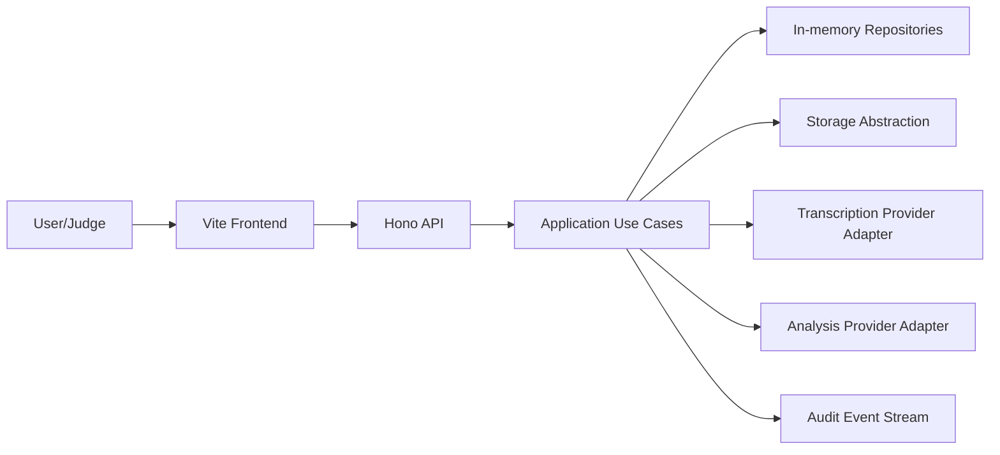
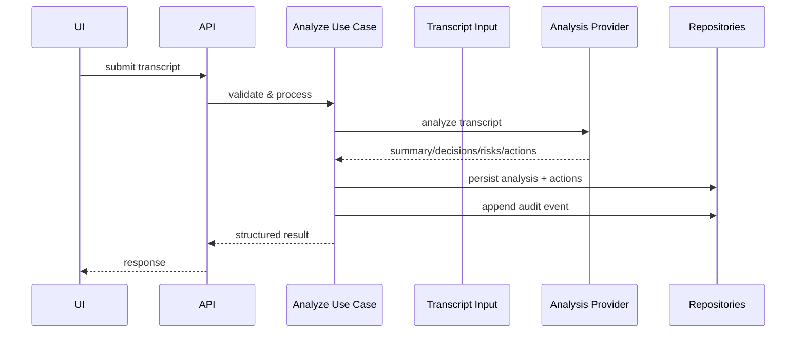
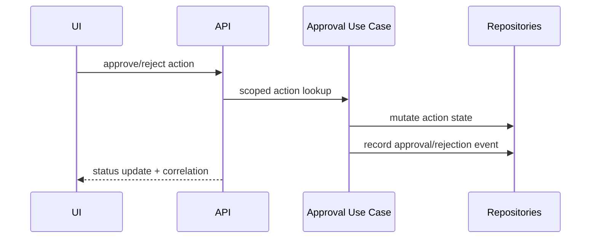
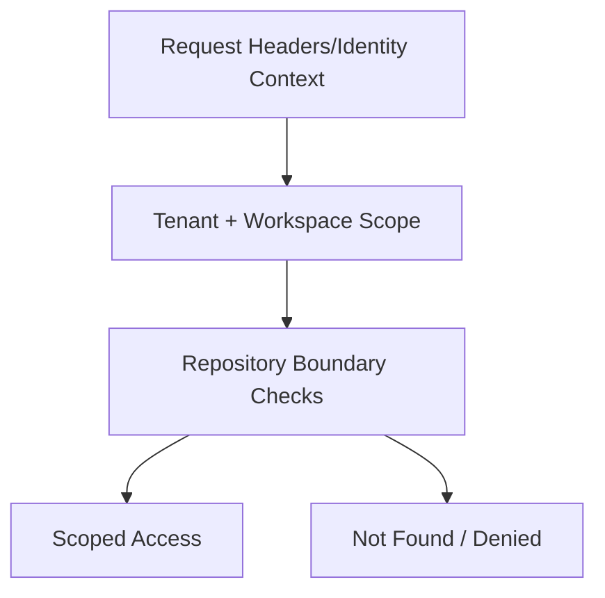
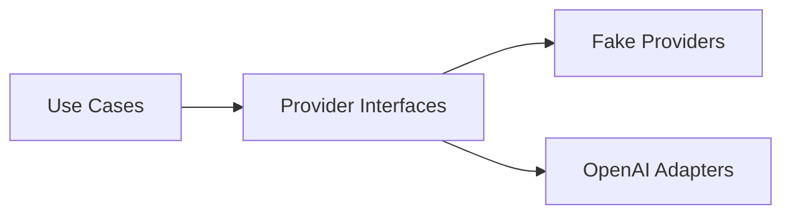
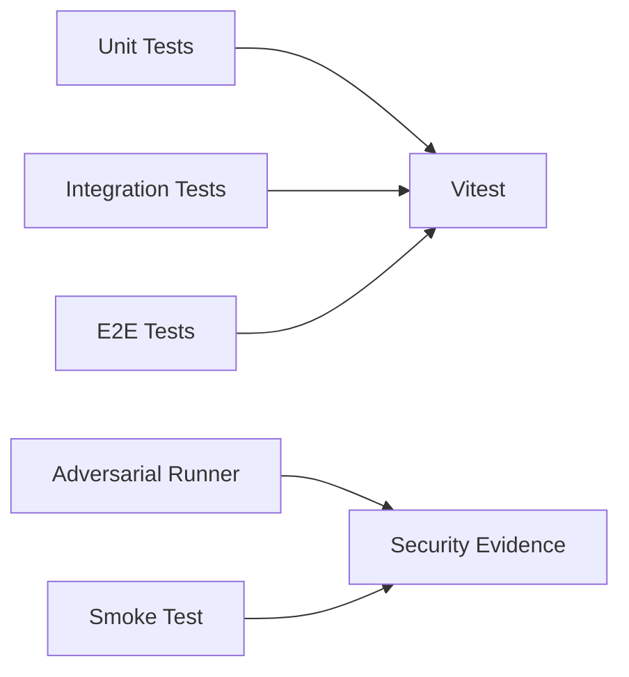

# Architecture Explainer

## Current architecture (implemented)
- Frontend: Vite SPA
- Backend: Hono API
- Use cases in application layer
- Domain contracts for providers/repositories
- In-memory repositories + storage abstraction
- Fake/OpenAI provider adapters
- Structured logging + recursive redaction
- Verification: Vitest (unit/integration/e2e), adversarial runner, smoke test

### 1) System Context (current)

### 2) Transcript Analysis Flow

### 3) Approval & Audit Flow

### 4) Tenant/Workspace Boundary

### 5) Provider Abstraction

### 6) Test & Verification Architecture

## Future enterprise architecture — planned, not implemented
- Durable DB/object storage
- Production identity and authorization
- Connector layer for Jira/Slack/Salesforce/meeting platforms
- Monitoring/analytics and operational controls
