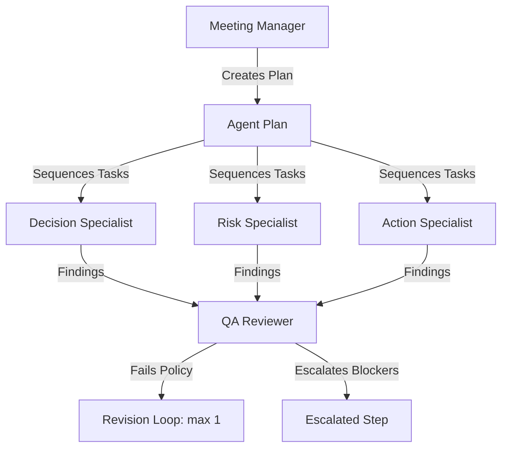

# Conversa — Multi-Agent Systems & Crew Specifications

---
### 📋 Document Metadata
- **Purpose**: Specifies roles, responsibilities, handoff mechanisms, and validation loops for all AI agents.
- **Audience**: AI systems architects, machine learning engineers, and QA leads.
- **Last Generated**: 2026-07-13T05:20:47+05:30
- **Confidence Level**: High (Direct correlation with files under `src/modules/agency`).
- **Evidence Used**: Agent implementations and the QA Reviewer step-revision rules.
- **Cross References**: See [ARCHITECTURE.md](file:///c:/Users/rajaj/Projects/1_Conversa/docs/ARCHITECTURE.md), [PROMPTS.md](file:///c:/Users/rajaj/Projects/1_Conversa/docs/PROMPTS.md).
- **Open Questions**: Dynamic multi-modal planning configurations.
- **Known Limitations**: Agent behaviors are simulated via deterministic evaluation cases in dev mode.
- **Recommended Next Actions**: Enforce TLS and HTTPS verification at deployment gateway.
---

## 1. Agent Roles & Responsibilities

The Conversa meeting analysis crew consists of five specialized AI agents operating under a central coordinator:



### 1.1 Meeting Manager (Orchestrator)
* **Responsibility**: Analyzes the meeting transcript text, determines which specialists are required, plans the sequence of execution, and manages final data persistence.
* **Public Interface**: `PlanMeetingAnalysis`
* **Trigger rules**: Analyzes transcript keywords to dynamically skip unnecessary specialist steps (e.g. skips `RISK_SPECIALIST` if no risk-related keywords are matched).

### 1.2 Decision Specialist (Specialist)
* **Responsibility**: Extracts decisions, rationale, owners, and grounding evidence from meeting transcripts.
* **Public Interface**: `DecisionSpecialist`

### 1.3 Risk Specialist (Specialist)
* **Responsibility**: Identifies potential project risks, blockers, compliance concerns, and vulnerabilities discussed during the session.
* **Public Interface**: `RiskSpecialist`

### 1.4 Action Specialist (Specialist)
* **Responsibility**: Extracts action items, assigns owners, sets priorities, maps target systems (Jira/Slack), and estimates due dates.
* **Public Interface**: `ActionSpecialist`

### 1.5 QA Reviewer (Validator / Gatekeeper)
* **Responsibility**: Validates specialist outputs against strict quality constraints and business policies.
* **Public Interface**: `QAReviewer`
* **Policy checks**: Enforces that high-priority action items must have assigned owners, and all action items must contain valid due dates.
* **Flow triggers**: If a check fails, it triggers a `REVISION` request; if the revision fails or has unresolved ambiguity, it triggers an `ESCALATED` block.

---

## 2. Handoff Protocol (`AgentHandoff`)

State is passed between agents inside a structured context envelope:
```typescript
interface AgentHandoff {
  fromAgent: string;
  toAgent: string;
  runId: string;
  taskId: string;
  relevantContext: string; // The transcript text
  priorFindings: {
    decisions: any[];
    risks: any[];
    proposedActions: any[];
  };
  policyConstraints: string[]; // Feedback messages from QA Reviewer
}
```

---

## 3. Automation & Scheduled Tasks
* **Cron sweeps (Horizon 1)**: An 8:00 AM daily cron job runs sweeps to identify overdue action items and post reminder digests to Slack channels.
* **Retention cleanups**: Periodic jobs clear meeting data older than `AUDIO_RETENTION_DAYS` (default: 90 days) to comply with data privacy policies.
