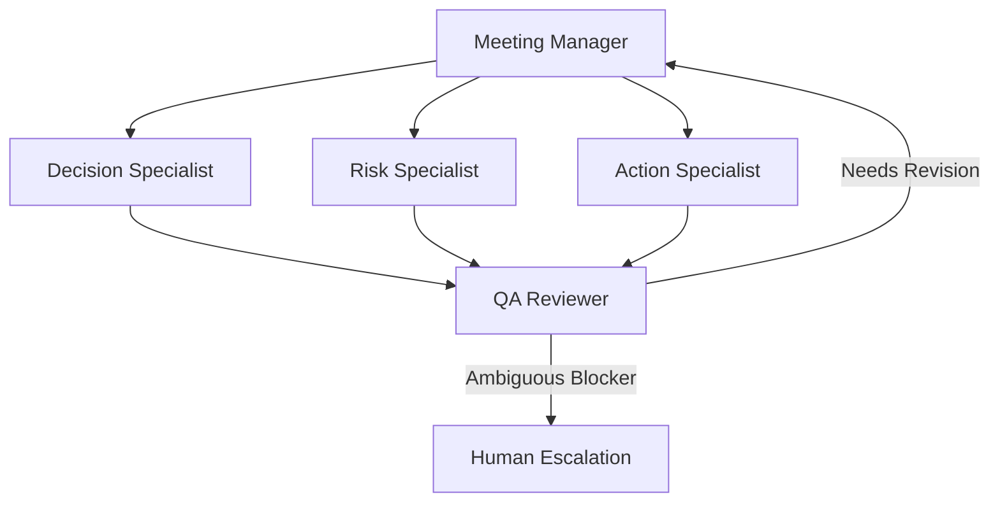

# AI Agency Architecture — Conversa

This document describes the architectural layout of the managed multi-agent meeting analysis agency in Conversa.

## Orchestration Model

Conversa uses a dynamic, bounded crew pattern orchestrated by the **Meeting Manager**. Rather than performing a single monolithic LLM call under the hood, the work is delegated to specialized, discrete roles:

## Agent Roles & Responsibilities

1. **Meeting Manager**
   - Parses the input transcript.
   - Generates a task-specific execution plan.
   - Evaluates dynamic skipping rules (e.g., skips the Risk Specialist if no risk keywords are present).

2. **Decision Specialist**
   - Extracts decisions, rationales, confidence scores, and source evidence.

3. **Risk Specialist**
   - Extracts risks, likelihood, impact, and mitigation options.

4. **Action Specialist**
   - Extracts actions, owners, due dates, priority, target systems, rationales, and risk levels.

5. **QA Reviewer**
   - Evaluates output grounding, missing entities, hallucinated properties, contradictions, and workspace policy alignment.
   - Triggers automatic revision or human escalation.

## State Transitions & Revision Control

- A specialist step may trigger a `REVISION_REQUIRED` state if the QA Reviewer detects a policy violation.
- A maximum of **one** automatic revision loop is executed per specialist in this phase.
- Context is transferred explicitly between specialists using the `AgentHandoff` envelope to enforce boundaries and prevent context leakage.
- If a resolution cannot be reached after one revision, the status changes to `ESCALATED`, documenting the exact blocker.
