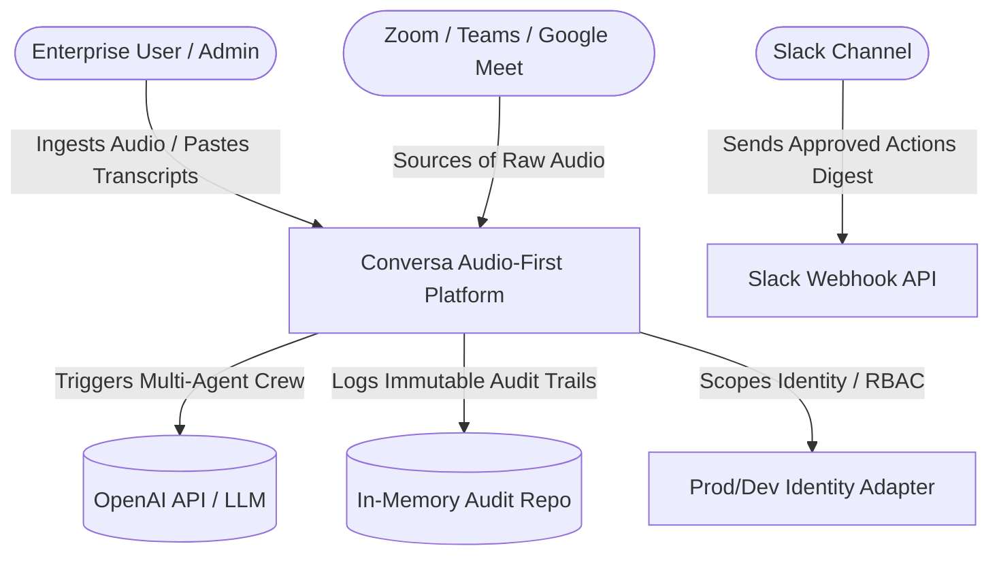
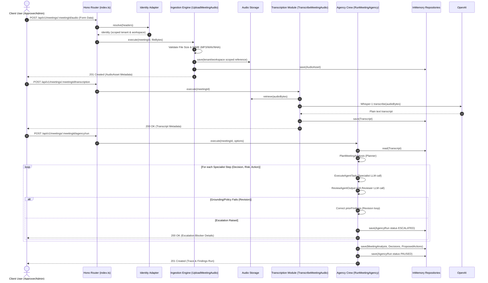

# Conversa — System Architecture & Logical Design

---
### 📋 Document Metadata
- **Purpose**: Canonical architectural specification defining system structure, component boundaries, sequence logic, and C4 context.
- **Audience**: Solution architects, engineering leads, SREs, and compliance auditors.
- **Last Generated**: 2026-07-13T05:20:47+05:30
- **Confidence Level**: High (Grounded directly in router setup, module hierarchy, and sequence definitions).
- **Evidence Used**: Core routes (`src/app/index.ts`), agency orchestrator (`run-meeting-agency.ts`), and modules.
- **Cross References**: See [PROJECT.md](file:///c:/Users/rajaj/Projects/1_Conversa/docs/PROJECT.md), [SERVICES.md](file:///c:/Users/rajaj/Projects/1_Conversa/docs/SERVICES.md), [MODULES.md](file:///c:/Users/rajaj/Projects/1_Conversa/docs/MODULES.md).
- **Open Questions**: Cryptographic token signature verification implementation.
- **Known Limitations**: ephemerality of in-memory data; single thread execution.
- **Recommended Next Actions**: Transition static memory repositories to Convex schema definitions.
---

## 1. C4 Context Diagram (Level 1)

---

## 2. Component Decomposition

The system is structured as a modular monolith running in serverless-friendly Hono Node.js processes, with the frontend acting as a Vite Vanilla Single Page Application (SPA).

| Component | Responsibility | Interfaces | Internal Dependencies |
| --- | --- | --- | --- |
| **Hono Backend App** | HTTP Router, Auth guards, Rate limiters, Body limits. | REST Endpoints under `/api/v1/*` | Modules (`meetings`, `media`, `transcription`, `analysis`, `agency`, `approvals`, `audit`) |
| **Vite Client App** | Client interface, upload forms, audit timelines, agency controls, run comparison. | Browser DOM, Vanilla CSS & JS | Fetch API to REST Router |
| **Meeting Manager** | CRUD meeting lifecycle and validations. | `CreateMeeting`, `GetMeeting` | `MeetingRepo`, `AuditRepo` |
| **Ingestion Engine** | Validates media files and scopes storage. | `UploadMeetingAudio` | `AudioAssetRepo`, `InMemoryAudioStorage` |
| **Transcription Provider** | Interfaces with Whisper to transcribe audio. | `AudioTranscriptionProvider`, `TranscribeMeetingAudio` | `TranscriptRepo`, `OpenAI API` |
| **Meeting Agency** | Coordinators, specialists planning, handoffs, loops, QA reviewing. | `RunMeetingAgency`, `PlanMeetingAnalysis`, `ExecuteAgentTask`, `ReviewAgentOutput` | `DecisionSpecialist`, `RiskSpecialist`, `ActionSpecialist`, `QAReviewer` |
| **Approval Guard** | Human approval gates for mutations and actions. | `ApproveProposedAction`, `RejectProposedAction` | `MeetingAnalysisRepo`, `AuditRepo` |
| **Audit Compliance** | Appends immutable logs of operations. | `RepoAuditPort`, `ListMeetingAuditEvents` | `AuditRepo` |

---

## 3. Data & Control Flow

### 3.1 Audio-to-Action Pipeline
The sequential process of transforming meeting audio into human-approved action outcomes:

---

## 4. Logical & Tenancy Scoping
* **Opaque References**: Raw audio filenames are obfuscated using random UUIDs and isolated directories: `storage/{tenantId}/{workspaceId}/{fileId}`.
* **Implicit Scoping**: In production, callers are locked into `cfg.DEMO_TENANT_ID` and `cfg.DEMO_WORKSPACE_ID`. Dev headers `x-tenant-id` are ignored, ensuring complete boundary isolation.
