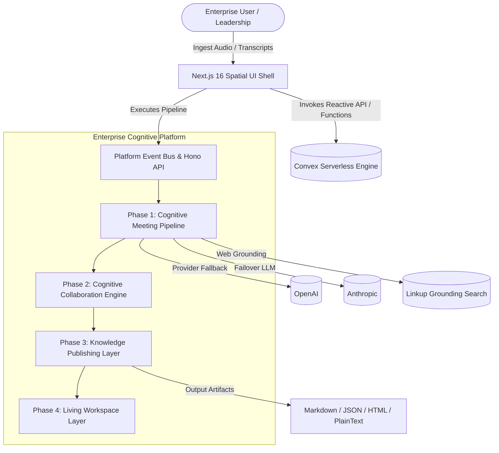
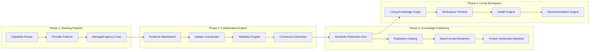
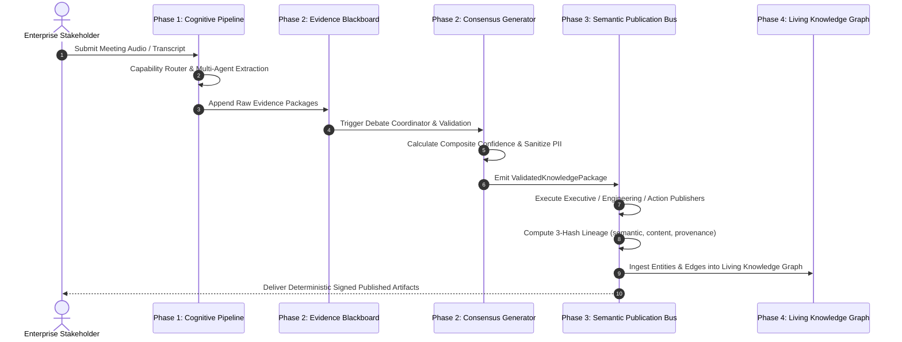

# Conversa — Enterprise Cognitive Platform Architecture

---
### 📋 Document Metadata
- **Purpose**: Architectural specification defining platform layers, C4 context, component boundaries, sequence flows, and 3-hash publishing verification.
- **Audience**: Enterprise architects, security leads, SREs, and platform engineers.
- **Last Generated**: 2026-07-20T06:54:00+05:30
- **Confidence Level**: Verified (Directly grounded in codebase implementation and passing test suites).
- **Evidence Used**: `src/modules/*` codebase, `convex/schema.ts`, Next.js UI shell, and 42 vitest test suites.
- **Cross References**: See [PROJECT.md](file:///c:/Users/rajaj/Projects/1_Conversa/docs/PROJECT.md), [MODULES.md](file:///c:/Users/rajaj/Projects/1_Conversa/docs/MODULES.md), [IMPLEMENTATION_STATUS.md](file:///c:/Users/rajaj/Projects/1_Conversa/docs/IMPLEMENTATION_STATUS.md).
---

## 1. Enterprise C4 Context



---

## 2. Platform Layer Component Architecture



---

## 3. End-to-End Enterprise Data Flow

### 3.1 Audio Ingestion to Cryptographic Knowledge Publication


---

## 4. Cryptographic 3-Hash Lineage Verification Model

Every published artifact generated by the Enterprise Knowledge Publishing Layer contains an immutable 3-hash lineage manifest:

```json
{
  "publicationId": "pub_exec_001",
  "sourcePackageId": "vkp_meeting_99",
  "semanticHash": "a4f8e... (SHA-256 of Canonical Semantic Model)",
  "contentHash": "7b12c... (SHA-256 of Rendered Output Artifact)",
  "provenanceHash": "9e33f... (SHA-256 of Provenance & Evidence Chain)"
}
```

* **`semanticHash`**: Guarantees canonical semantic equivalence across different audience views.
* **`contentHash`**: Ensures rendered output integrity (Markdown / HTML / JSON / Text).
* **`provenanceHash`**: Cryptographically anchors facts back to raw transcript line numbers and speaker evidence.

---

## 5. Security & Isolation Boundaries

1. **Multi-Tenancy Scoping**: Strict boundary checking enforced on every request (`tenantId`, `workspaceId`).
2. **Data Residency Guardrails**: Package policy checks enforcing data residency rules (`US`, `EU`, `India`, `Global`, `CustomerManaged`, `AirGapped`).
3. **Log Redaction**: Automatic recursive redaction of sensitive credentials, tokens, and PII in system telemetry.
