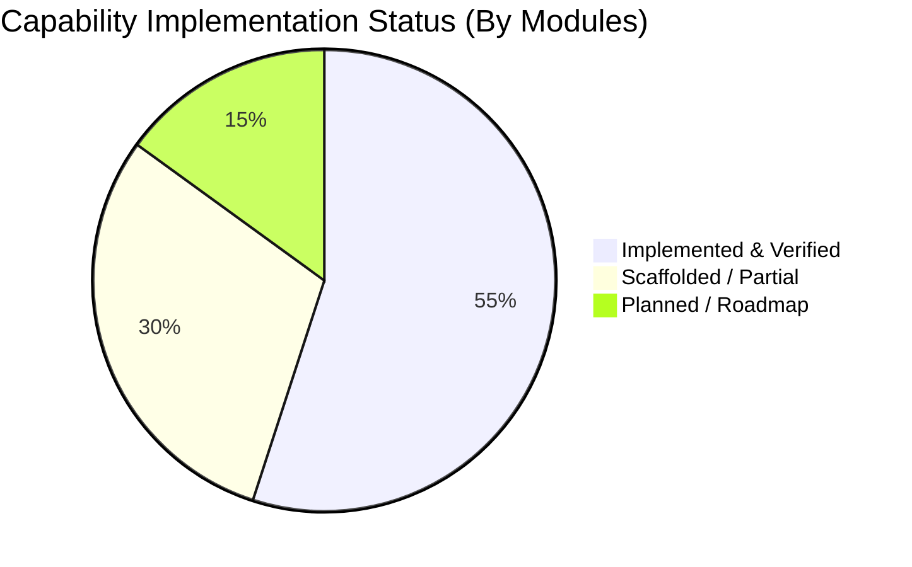

# Conversa — Comprehensive Capability Matrix & Codebase Audit

---

### 📋 Document Metadata
- **Document Title**: Conversa Platform Capability Matrix & Codebase Inventory
- **Author Role**: Principal Product Manager, Systems Architect, Lead Developer
- **Last Updated**: 2026-07-22
- **Audit Basis**: Repository code review (`convex/`, `src/`, `app/`, `components/`) and runtime test execution.

---

## 1. Capability Inventory & Maturity Overview

Conversa's architecture is categorized into 5 core functional pillars:
1. **Meeting Audio & Transcript Ingestion**
2. **Multi-Agent AI Agency & Knowledge Extraction**
3. **Governance, HITL Gating & Audit Lineage**
4. **Native Task Hand-Off & Ecosystem Integration**
5. **Living Workspace & Analytics Dashboard**

---

## 2. Detailed Capability Matrix

| Pillar | Capability Name | Codebase Location / Schema | Status | Description & Verification Evidence |
| :--- | :--- | :--- | :--- | :--- |
| **Ingestion** | Audio Upload Ingestion | `convex/schema.ts` (`audio_assets`) | **Implemented** | Supports MP3, WAV, M4A up to 10MB; checksum validation and storage reference tracking. |
| **Ingestion** | Passthrough Transcript Import | `convex/schema.ts` (`transcripts`) | **Implemented** | Pasted and imported transcript segments with timestamp (`startMs`, `endMs`) & speaker identification. |
| **Ingestion** | Smart Device Mobile Capture | `app/meetings/` | **Scaffolded** | Mobile PWA audio capture interface scaffolded; native iOS/Android mic stream pending SDK wrap. |
| **Ingestion** | Zoom / Teams Bot Integration | `app/api/webhooks/` | **Planned** | OAuth webhook receiver & meeting bot join capability on strategic roadmap. |
| **AI Agency** | Multi-Agent Crew Pipeline | `src/modules/cognitive-collaboration/` | **Implemented** | Orchestrates Manager, Decision Specialist, Risk Specialist, and Action Specialist agents. |
| **AI Agency** | Precision/Recall Eval Suite | `evaluation/` (`run-eval.ts`) | **Implemented** | Grounding and benchmark evaluation suite verifying $\ge 80\%$ recall and $100\%$ owner assignment. |
| **AI Agency** | Real-Time Agent Feedback Loop | `src/modules/interaction-intelligence/` | **Implemented** | Multi-round QA review and agent revision request pipeline. |
| **Governance**| Tenant & Workspace Isolation | `convex/schema.ts` (`tenantId`, `workspaceId` index) | **Implemented** | Strict multi-tenancy enforced across all database queries and index scans. |
| **Governance**| Human-in-the-Loop Approval Gate | `components/meetings/processing-stepper.tsx` | **Implemented** | Manual approval/rejection endpoint gating task publication (`status: pending -> approved`). |
| **Governance**| Cryptographic 3-Hash Lineage | `src/modules/knowledge-publishing/` | **Implemented** | Generates `semanticHash`, `contentHash`, and `provenanceHash` for immutable audit tracking. |
| **Hand-Off**  | Generic Outbound Webhooks | `convex/graph.ts` / `src/modules/integrations` | **Implemented** | Outbound HTTP webhook trigger on approved task events. |
| **Hand-Off**  | Jira Native Format Connector | `app/integrations/` | **Scaffolded** | UI configuration modal implemented; Jira v3 REST API ADF payload formatter scaffolded. |
| **Hand-Off**  | Linear GraphQL Connector | `app/integrations/` | **Scaffolded** | Linear API payload mapper scaffolded in integration module. |
| **Hand-Off**  | GitHub Issues Connector | `app/integrations/` | **Scaffolded** | GitHub REST API issue payload mapping scaffolded. |
| **Hand-Off**  | Slack Interactive Block Kit Gate| `components/integrations/` | **Scaffolded** | Slack interactive message block layout designed for single-tap approvals. |
| **Workspace** | Interactive Dashboard & Views | `app/workspace/`, `convex/views.ts` | **Implemented** | Custom view definitions, saved searches, filtering, and object type views. |
| **Workspace** | Knowledge Search & RAG | `convex/search.ts`, `convex/knowledge.ts` | **Implemented** | Full-text and vector search over extracted decisions, risks, and meeting transcripts. |

---

## 3. Implemented vs. Non-Goal Inventory

### 3.1 Implemented Capabilities (Proven by Code)
* Multi-tenant relational document graph (`knowledge_objects`, `object_types`, `field_definitions`, `graph_edges`).
* Multi-agent agency execution pipeline (`Manager`, `Decision`, `Risk`, `Action` Specialists).
* Ground truth benchmarking script (`evaluation/run-eval.ts`).
* Audio asset checksum deduplication (`by_checksum` index in Convex).

### 3.2 Explicit Non-Goals (Capabilities Excluded by Architecture)
* **Video Modality**: No video uploads, rendering, or avatars (see `docs/adr/0002-audio-first-media-scope.md`).
* **Proprietary Note Graph UI**: No Tana-style node outliner or canvas editor.
* **User-Managed Supertag Engine**: Fixed enterprise schemas replace manual tag configuration.
* **Internal Work Manager**: Tasks are exported to native enterprise tools rather than managed internally.

---

### Cross References
* [PRODUCT_STRATEGY.md](file:///c:/Users/rajaj/Projects/1_Conversa/docs/PRODUCT_STRATEGY.md) — Universal Product Strategy.
* [STRATEGIC_GAP_ANALYSIS.md](file:///c:/Users/rajaj/Projects/1_Conversa/docs/STRATEGIC_GAP_ANALYSIS.md) — Strategic gaps and recommendations.
* [TECHNICAL_DEBT_AND_ARCHITECTURE.md](file:///c:/Users/rajaj/Projects/1_Conversa/docs/TECHNICAL_DEBT_AND_ARCHITECTURE.md) — Architecture & cloud audit.
