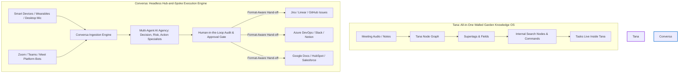
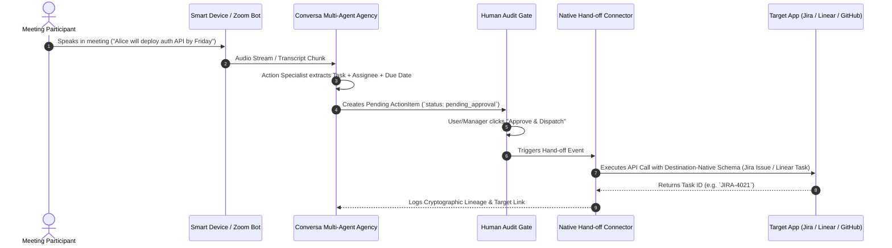
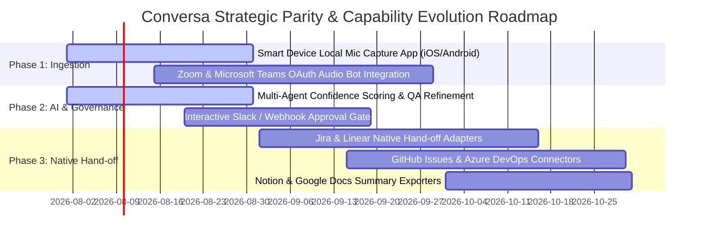

# Conversa vs. Tana & Ecosystem: Competitive Parity & Strategic Intelligence Report

---

### 📋 Document Metadata
- **Document Title**: Conversa vs. Competitor Ecosystem Parity & Strategic Differentiation Analysis
- **Target URL Reference**: [https://github.com/rjmad1/1_Conversa_HermesBuildathon/blob/main/docs/COMPETITOR_PARITY.md](https://github.com/rjmad1/1_Conversa_HermesBuildathon/blob/4eb6475f8d2ab210e2ca7ff0bc597f34b1670749/docs/COMPETITOR_PARITY.md)
- **Primary Reference Ecosystem**: [Tana (tana.inc)](https://tana.inc/learn/features/docs)
- **Secondary Reference Ecosystems**: Otter.ai, Fathom.video, Fireflies.ai, Gong, Notion AI, Granola.so
- **Author Role**: Chief Product Officer, Enterprise Product Strategist, Principal Software Architect
- **Last Updated**: 2026-07-22
- **Scope & Context**: Defines Conversa's strategic positioning as a **Headless Hub-and-Spoke Meeting Capture & Native Task Execution Engine**, directly contrasting with Tana's **All-in-One Walled-Garden Knowledge Graph**.

---

## 1. Executive Summary & Core Strategic Thesis

### 1.1 The Fundamental Paradigm Shift
The productivity and meeting intelligence market is split into two opposing architectural paradigms:

### 1.2 Core Thesis: Hub-and-Spoke Hand-off vs. Walled Garden
* **Tana (`tana.inc`)** position: Tana is a general-purpose, node-based outliner and personal/team knowledge OS. It requires users to adopt a proprietary UI, build complex supertag schemas, manually type or record notes into Tana nodes, and manage their daily work inside Tana's graph. Tana forces teams to migrate their work management *into* Tana.
* **Conversa** position: Conversa is an opinionated, zero-friction **Meeting Capture and Application Hand-off Engine**. Conversa captures meeting audio across smart devices (smartphones, wearables, desktop microphones) and virtual conferencing platforms (Zoom, Teams, Meet). It extracts structured decisions, risks, and action items using multi-agent AI, passes them through a human-in-the-loop approval gate, and **hands over task execution in the native format and payload structure required by downstream destination tools** (Jira, Linear, GitHub Issues, Azure DevOps, Notion, Slack, HubSpot).

> [!IMPORTANT]
> **Conversa's Strategic Rule**: Conversa does **NOT** try to replace Jira, Linear, Notion, or Slack as a work management UI. Conversa acts as the **intelligent capture, transformation, and routing middleware** that translates spoken human conversation into executed work in the systems enterprise teams already use.

---

## 2. Competitive Intelligence: Capability Parity Matrix

The following matrix compares **Conversa** directly against **Tana (`tana.inc`)**, **Otter.ai**, **Fathom**, **Fireflies.ai**, and **Granola**:

| Feature / Dimension | Tana (`tana.inc`) | Otter.ai / Fathom | Granola.so | Conversa (Target Architecture) | Parity Status & Strategic Position |
| :--- | :--- | :--- | :--- | :--- | :--- |
| **Primary Ingestion Vector** | Text outliner, manual notes, Tana Voice app | Zoom/Teams bot recorder | Mac desktop audio + manual template | **Smart devices (iOS/Android/Wearables), Desktop Mic, & Platform Bots (Zoom/Teams/Meet)** | **Strategic Superiority**: Multi-device & multi-platform capture without forcing UI usage |
| **Core Architecture** | Fluid node-based knowledge graph | Audio recording & transcript player | Local markdown notepad + LLM | **Relational Document Store + Multi-Agent Execution Pipeline** | **Differentiated**: Rigid governance and state management over fluid notes |
| **Data Schema & Structure** | User-defined Supertags (Dynamic fields) | Unstructured text with auto-summary | Fixed summary templates | **Domain-Driven Schemas (`convex/schema.ts`): Meetings, Actions, Decisions, Risks** | **Parity by Design**: System-enforced schemas eliminate setup friction |
| **AI Processing Engine** | Single-prompt Tana AI Core / AI Commands | Linear LLM summarization | Custom system prompt per doc | **Multi-Agent Agency Crew (Manager, Decision Specialist, Risk Specialist, Action Specialist)** | **Strategic Superiority**: Specialized multi-agent cross-verification & QA rating |
| **Task Execution & Hand-off** | Internal Tana nodes / basic webhooks | Export to Zapier / copy text | Copy markdown to clipboard | **Native Format-Aware Hand-off Connectors (Jira, Linear, GitHub, Azure DevOps, Slack, Notion)** | **Core Strategic Differentiator**: Direct, format-native payload hand-off |
| **Human-in-the-Loop Gate** | None (Immediate edit in node) | None | None | **Formal Action Approval & Audit Trail (`status: pending -> approved -> dispatched`)** | **Enterprise Differentiator**: Prevents unverified AI tasks from cluttering target systems |
| **User Learning Curve** | High (Requires learning supertags, commands, search nodes) | Low (Passive listener) | Low (Local notes app) | **Zero Friction (Passive capture + Push notifications / Slack approval)** | **Strategic Advantage**: No user training or schema design required |
| **Enterprise Governance** | User-managed access controls | Workspace sharing controls | Personal local storage | **Strict Multi-Tenant Isolation (`tenantId`, `workspaceId`), RBAC, Cryptographic 3-Hash Lineage** | **Enterprise Differentiator**: Built for enterprise security & compliance |

---

## 3. Deep-Dive Feature Breakdown: Tana Ecosystem vs. Conversa

### 3.1 Supertags vs. Domain-Driven Meeting Schemas
* **Tana Supertags**: Allow users to tag any node `#meeting` or `#task` and attach arbitrary custom fields (e.g. `Due Date`, `Assignee`, `Status`). While flexible, supertags suffer from **high configuration overhead**, **schema drift**, and **lack of team standardization**.
* **Conversa Solution**: Conversa eliminates configuration friction by providing out-of-the-box, enterprise-validated schemas for `Meeting`, `Transcript`, `Decision`, `Risk`, and `ActionItem`. 
* **Hand-off Transformation**: Instead of forcing users to configure fields, Conversa's multi-agent engine automatically maps extracted entities into the destination app's schema:
  - **For Jira**: Maps `ActionItem` $\rightarrow$ Jira Issue Payload (`projectKey`, `issueType: Task`, `summary`, `description`, `assigneeAccountId`, `dueDate`).
  - **For Linear**: Maps `ActionItem` $\rightarrow$ Linear GraphQL Input (`teamId`, `title`, `description`, `assigneeId`, `priority`).
  - **For GitHub**: Maps `ActionItem` $\rightarrow$ GitHub Issue API (`owner`, `repo`, `title`, `body`, `assignees`, `labels`).
  - **For Slack**: Maps `ActionItem` $\rightarrow$ Interactive Block Kit Message with "Approve & Dispatch" buttons.

---

## 4. What Conversa Will NEVER Build (Non-Goals & Anti-Patterns)

To maintain extreme focus, technical sustainability, and low total cost of ownership (TCO), Conversa explicitly excludes the following Tana-like capabilities:

1. **proprietary Outliner / Rich Text Note Graph**:
   * *Why*: Enterprise users do not want another note-taking tool. They already use Notion, Coda, Confluence, or Google Docs. Conversa will not build a block editor or outline graph UI.
2. **End-User Custom Supertag Builder**:
   * *Why*: Configuring custom schemas causes administrative fatigue. Conversa provides fixed, robust schemas for meeting intelligence and allows target system field mappings.
3. **Internal Project Management & Kanban Suites**:
   * *Why*: Conversa is an ingestion and hand-off engine, not a project management tool. Conversa hands tasks over to Jira, Linear, and Azure DevOps where project management belongs.
4. **Offline Desktop Knowledge Vault (Obsidian/Tana Desktop Clone)**:
   * *Why*: Conversa is a multi-tenant cloud platform built for real-time collaboration, team auditability, and central governance.

---

## 5. Strategic Gap Analysis & Actionable Parity Roadmap

To solidify Conversa's market dominance as the premier Meeting Capture & Task Hand-off Platform, the following gaps must be closed:

### 5.1 Gaps & Required Initiatives

#### Priority 1: Multi-Channel Ingestion Expansion
* **Gap**: Conversa currently supports manual audio file upload and pasted transcript.
* **Initiative**: Implement native smart device audio capture (mobile PWA / native audio recording SDK) and Zoom / Microsoft Teams OAuth integration bots to capture meeting audio automatically.

#### Priority 2: Format-Aware Hand-off Connector Suite
* **Gap**: Task actions are currently stored in `convex/schema.ts` under `knowledge_objects` but require explicit outbound webhook dispatchers.
* **Initiative**: Build a modular integration framework in `src/modules/integrations/` supporting:
  - **Jira REST API v3 Adapter** (Issue creation, ADF description formatting, assignee resolution).
  - **Linear GraphQL API Adapter** (Issue creation, team key mapping, label assignment).
  - **GitHub REST / GraphQL Adapter** (Issue creation, repository routing, project board placement).
  - **Azure DevOps REST API Adapter** (Work Item creation, area path assignment).
  - **Slack Block Kit Connector** (In-channel notification, interactive approval, task status updates).

#### Priority 3: Interactive Approval & Audit Gate
* **Gap**: Human-in-the-loop approval currently exists in backend state but lacks instant push notification workflows.
* **Initiative**: Deliver an interactive Slack/Email notification trigger that allows engineering managers to approve, edit, or reject proposed meeting action items with a single tap.

---

## 6. Strategic Summary & Success Criteria

Conversa wins by **not being Tana**.

While Tana attempts to lock organizations into a complex, closed knowledge outliner, Conversa liberates organizational knowledge by:
1. **Capturing conversation wherever it happens** (smartphones, wearables, Zoom, Teams, conference rooms).
2. **Refining raw talk into verified work** using specialized multi-agent AI.
3. **Dispatching execution immediately to destination systems** (Jira, Linear, GitHub, Slack) in the exact format required.

---

### Cross References
* [PRODUCT_STRATEGY.md](file:///c:/Users/rajaj/Projects/1_Conversa/docs/PRODUCT_STRATEGY.md) — 10-Phase Enterprise Strategy & Strategic Framework.
* [ROADMAP.md](file:///c:/Users/rajaj/Projects/1_Conversa/docs/ROADMAP.md) — Feature evolution timeline & RICE prioritization.
* [CAPABILITY_MATRIX.md](file:///c:/Users/rajaj/Projects/1_Conversa/docs/CAPABILITY_MATRIX.md) — Inventory of implemented vs. scaffolded features.
