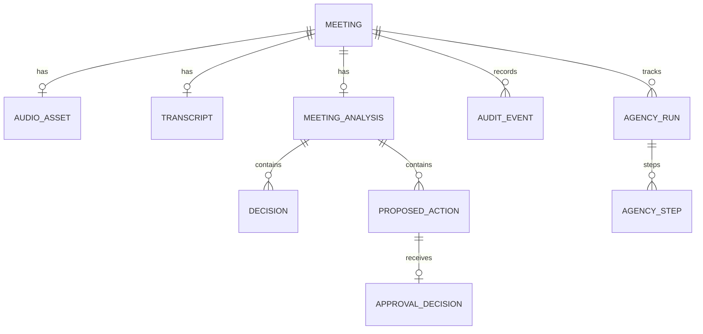

# Conversa — Database Design & Schema Mappings

---
### 📋 Document Metadata
- **Purpose**: Describes the relational data structures, schemas, entity fields, indexes, and constraints.
- **Audience**: Database engineers, software architects, and DevOps.
- **Last Generated**: 2026-07-13T05:20:47+05:30
- **Confidence Level**: High (Grounded directly in Zod schemas in `src/shared/validation/schemas.ts` and in-memory map repos).
- **Evidence Used**: Zod model schema definitions and memory-mapped repositories.
- **Cross References**: See [ARCHITECTURE.md](file:///c:/Users/rajaj/Projects/1_Conversa/docs/ARCHITECTURE.md), [API.md](file:///c:/Users/rajaj/Projects/1_Conversa/docs/API.md), [EVENTS.md](file:///c:/Users/rajaj/Projects/1_Conversa/docs/EVENTS.md).
- **Open Questions**: Rotation policy for static Bearer tokens.
- **Known Limitations**: ephemerality of in-memory data; no migrations.
- **Recommended Next Actions**: Transition static memory repositories to Convex schema definitions.
---

## 1. Entity Schema Definitions

Even though the current prototype maintains state within volatile Map-based repositories, all records are fully schema-typed and ready for relational SQL deployment (e.g. SQLite / Cloudflare D1).

---

## 2. Table Roster & Key Fields

### 2.1 Meetings Table (`meetings`)
Stores baseline session data and parameters.
* **Fields**:
  * `id`: UUID (Primary Key)
  * `tenantId`: String (Index)
  * `workspaceId`: String (Index)
  * `title`: String
  * `meetingType`: Enum (`CEREMONY` | `EVAL` | `CUSTOM`)
  * `status`: Enum (`CREATED` | `READY` | `FAILED`)
  * `scheduledAt`: ISO Date
  * `createdBy`: String
  * `createdAt`: ISO Date
  * `updatedAt`: ISO Date

### 2.2 Audio Assets Table (`audio_assets`)
Keeps storage pointers and metadata for validated uploads.
* **Fields**:
  * `id`: UUID (Primary Key)
  * `tenantId`: String
  * `workspaceId`: String
  * `meetingId`: UUID (Foreign Key -> `meetings.id`)
  * `fileName`: String
  * `fileSize`: Integer
  * `mimeType`: String (Allowed: `audio/mpeg`, `audio/wav`, `audio/mp4`)
  * `checksum`: String (SHA256, Index for deduplication)
  * `storageReference`: String (Opaque scope path: `storage/{tenant}/{workspace}/{id}`)
  * `createdAt`: ISO Date

### 2.3 Transcripts Table (`transcripts`)
Normalized textual transcript mappings.
* **Fields**:
  * `id`: UUID (Primary Key)
  * `tenantId`: String
  * `workspaceId`: String
  * `meetingId`: UUID (Foreign Key)
  * `source`: Enum (`INGEST` | `PASTE` | `IMPORT`)
  * `language`: String
  * `content`: Text (Min 10 characters)
  * `segments`: JSON Array (Speaker diarization chunks)
  * `status`: Enum (`PROCESSING` | `READY` | `FAILED`)

### 2.4 Proposed Actions Table (`proposed_actions`)
AI-extracted work items awaiting approval.
* **Fields**:
  * `id`: UUID (Primary Key)
  * `meetingId`: UUID (Foreign Key)
  * `description`: String (Min 3 characters)
  * `ownerName`: String (Nullable)
  * `dueDate`: ISO Date String (Nullable)
  * `priority`: Enum (`LOW` | `MEDIUM` | `HIGH`)
  * `targetSystem`: Enum (`JIRA` | `SLACK` | `INTERNAL` | `SALESFORCE`)
  * `actionType`: Enum (`TASK` | `MEETING` | `DOCUMENTATION` | `RESEARCH`)
  * `rationale`: String
  * `sourceEvidence`: String
  * `confidence`: Float (0.0 to 1.0)
  * `riskLevel`: Enum (`LOW` | `MEDIUM` | `HIGH`)
  * `status`: Enum (`PROPOSED` | `APPROVED` | `REJECTED`)
  * `ownerReference`: String (Nullable)

### 2.5 Agency Runs & Steps (`agency_runs` / `agency_steps`)
Traces of multi-agent runs.
* **Agency Runs**:
  * `runId`: UUID (Primary Key)
  * `tenantId`: String
  * `workspaceId`: String
  * `meetingId`: UUID (Foreign Key)
  * `status`: Enum (`RUNNING` | `PAUSED` | `COMPLETED` | `ESCALATED` | `FAILED`)
  * `plan`: JSON (Agent task sequences)
  * `totalLatencyMs`: Integer
  * `estimatedCost`: Float
* **Agency Steps**:
  * `stepId`: UUID (Primary Key)
  * `runId`: UUID (Foreign Key -> `agency_runs.runId`)
  * `tenantId`: String
  * `workspaceId`: String
  * `agentRole`: String (`DECISION_SPECIALIST` | `RISK_SPECIALIST` | `ACTION_SPECIALIST` | `QA_REVIEWER`)
  * `status`: Enum (`RUNNING` | `COMPLETED` | `ESCALATED` | `FAILED`)
  * `revisionCount`: Integer (Max 1)
  * `escalationReason`: String (Nullable)

---

## 3. Database Constraints & Index Rules
1. **Tenancy Lock**: All index layouts and queries MUST compose composite matches on `(tenantId, workspaceId)` before checking other keys.
2. **Checksum Deduplication**: Unique constraints or index searches on `(tenantId, workspaceId, meetingId, checksum)` prevent duplicate audio ingestion.
3. **Audit Immutability**: The `audit_events` table does not expose update or delete methods, only appends.
