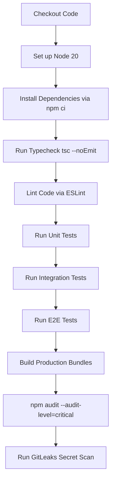

# Conversa — Deployment & CI/CD Architecture

---
### 📋 Document Metadata
- **Purpose**: Defines hosting targets, environment configurations, CI/CD workflow steps, and rollbacks.
- **Audience**: DevOps engineers, system operators, and SREs.
- **Last Generated**: 2026-07-13T05:20:47+05:30
- **Confidence Level**: High (Verified against active workflows and project configuration files).
- **Evidence Used**: Root configuration `.github/workflows/security-ci.yml`, `package.json` scripts, and `vercel.json`.
- **Cross References**: See [ARCHITECTURE.md](file:///c:/Users/rajaj/Projects/1_Conversa/docs/ARCHITECTURE.md), [PERFORMANCE.md](file:///c:/Users/rajaj/Projects/1_Conversa/docs/PERFORMANCE.md).
- **Open Questions**: Automated blue-green deployment switches.
- **Known Limitations**: Ephemeral database deployment.
- **Recommended Next Actions**: Enforce TLS and HTTPS verification at deployment gateway.
---

## 1. Target Infrastructure Environments

Conversa is built to support serverless and edge hosting targets:

### 1.1 Cloudflare Stack (Target Pilot Architecture)
* **API / App Handler**: Cloudflare Workers (retains longer execution timeouts than standard serverless).
* **Audio Object Storage**: Cloudflare R2 (enforces opaque, tenant-scoped storage structures).
* **Static Client Serving**: Cloudflare Pages.
* **Metadata Store**: Cloudflare D1 (relational SQLite database).

### 1.2 Vercel / Node Server (Demo / MVP Runtime)
* **Application Server**: Node Server hosted on Vercel Serverless (using `@hono/node-server`).
* **Metadata Store**: Ephemeral in-memory repositories.
* **Ingestion Limits**: In-memory body size parsing restrictions (`AUDIO_MAX_BYTES`).

---

## 2. Audio Storage Layout & Tenancy Scoping
Raw audio assets are stored inside the `conversa-media` bucket and scoped by tenant and workspace identifiers:
```text
conversa-media/tenants/{tenantId}/workspaces/{workspaceId}/media/{assetId}
```
* **Security Constraints**: `assetId` is represented by an obfuscated UUID. Database records store only metadata and the `storageReference` path — **never raw audio bytes**. Raw audio is never logged.

---

## 3. GitHub Actions Continuous Integration (`security-ci.yml`)

The automated QA and security pipeline runs on every push and pull-request targeting the `main`/`master` branches:



---

## 4. Rollback & Disaster Recovery Procedures
1. **Rollback Actions**: In Cloudflare deployments, use `wrangler rollback` or trigger a previous build deploy from the Pages portal. On Vercel, redeploy the target Git SHA from the dashboard.
2. **Disaster Recovery**: Since the current prototype database is volatile, a disaster recovery scenario requires redeployment of the API and invoking the workspace administrative setup scripts to rebuild structures.
3. **Data Backups**: Audio object storage files in R2 can be configured with automated replication rules across multi-regions.
