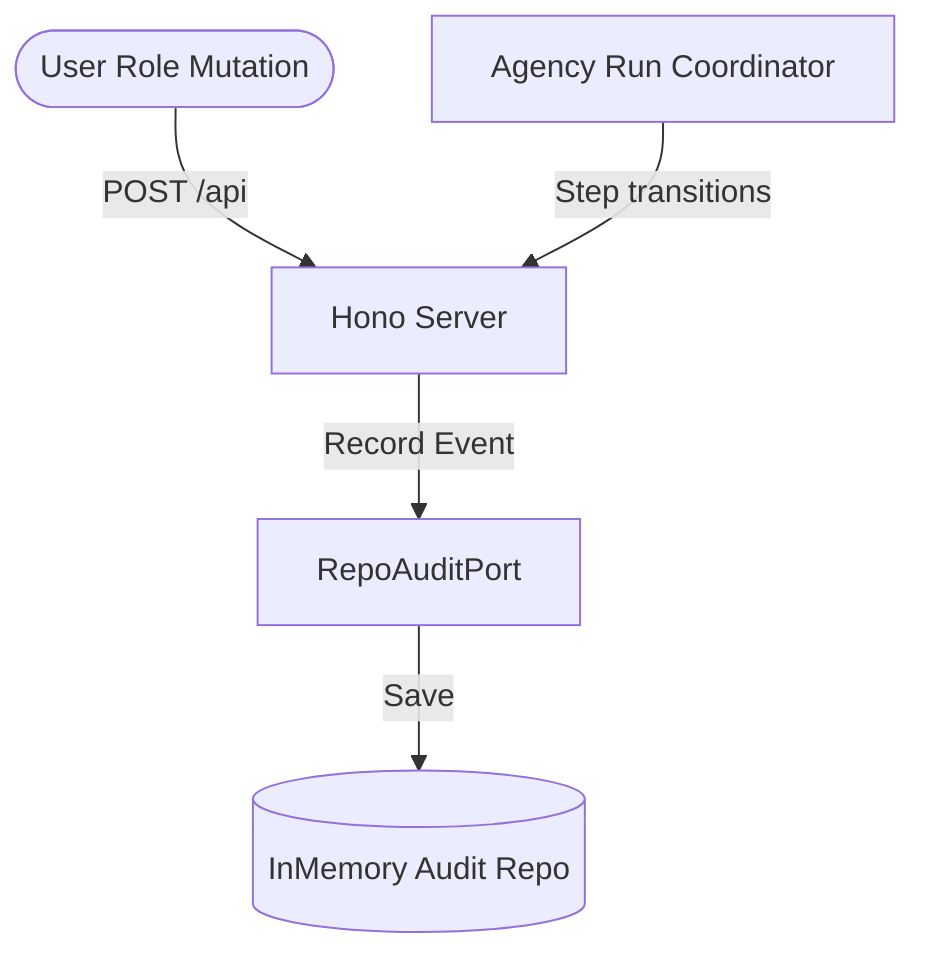

# Conversa — Event & Audit Log Schema

---
### 📋 Document Metadata
- **Purpose**: Defines all internal operational events, audit events, payload schemas, and retry behaviors.
- **Audience**: Compliance auditors, software architects, and integration engineers.
- **Last Generated**: 2026-07-13T05:20:47+05:30
- **Confidence Level**: High (Grounded in Audit Event definitions in `schemas.ts` and API routes).
- **Evidence Used**: Core audit recordings in `src/app/index.ts` and `run-meeting-agency.ts`.
- **Cross References**: See [DATABASE.md](file:///c:/Users/rajaj/Projects/1_Conversa/docs/DATABASE.md), [OBSERVABILITY.md](file:///c:/Users/rajaj/Projects/1_Conversa/docs/OBSERVABILITY.md).
- **Open Questions**: Real-time message broker selection (Redis Pub/Sub vs. Cloudflare Queue).
- **Known Limitations**: ephemerality of in-memory logs; synchronous logs.
- **Recommended Next Actions**: Enforce TLS and HTTPS verification at deployment gateway.
---

## 1. Event Publisher & Consumer Architecture

All operational events and audits are captured and recorded using a centralized port (`RepoAuditPort`) mapping to the database persistence layer.



---

## 2. Event Registry & Payload Schemas

### 2.1 WORKSPACE_RESET
* **Publisher**: Hono REST App (Admin route handler)
* **Consumer**: Audit Logging, Systems Administrator
* **Payload**:
  ```json
  {
    "id": "event-uuid",
    "tenantId": "demo",
    "workspaceId": "demo",
    "actorId": "prod-admin",
    "actorType": "user",
    "meetingId": "00000000-0000-0000-0000-000000000000",
    "entityType": "WORKSPACE",
    "entityId": "demo",
    "eventType": "WORKSPACE_RESET",
    "metadata": { "tenantId": "demo" },
    "createdAt": "2026-07-13T05:20:47Z"
  }
  ```

### 2.2 AGENCY_RUN: PLAN_CREATED
* **Publisher**: `RunMeetingAgency`
* **Payload**:
  ```json
  {
    "eventType": "PLAN_CREATED",
    "entityType": "AGENCY_RUN",
    "entityId": "run-uuid",
    "metadata": {
      "plan": {
        "steps": [
          { "agentRole": "DECISION_SPECIALIST", "taskType": "EXTRACT_DECISIONS", "skipped": false },
          { "agentRole": "RISK_SPECIALIST", "taskType": "EXTRACT_RISKS", "skipped": false },
          { "agentRole": "ACTION_SPECIALIST", "taskType": "EXTRACT_ACTIONS", "skipped": false }
        ]
      }
    }
  }
  ```

### 2.3 AGENCY_STEP: REVISION_REQUESTED
* **Publisher**: `RunMeetingAgency` execution loop
* **Description**: Triggered when the `QA_REVIEWER` rejects findings and requests adjustments.
* **Payload**:
  ```json
  {
    "eventType": "REVISION_REQUESTED",
    "entityType": "AGENCY_STEP",
    "entityId": "step-uuid",
    "metadata": {
      "agentRole": "ACTION_SPECIALIST",
      "reason": "Needs revision: missing due dates on high priority tasks"
    }
  }
  ```

### 2.4 AGENCY_STEP: ESCALATION_RAISED
* **Publisher**: `RunMeetingAgency` execution loop
* **Description**: Triggered when revision thresholds are exceeded or the QA Reviewer detects unresolved conflicts.
* **Payload**:
  ```json
  {
    "eventType": "ESCALATION_RAISED",
    "entityType": "AGENCY_STEP",
    "entityId": "step-uuid",
    "metadata": {
      "agentRole": "ACTION_SPECIALIST",
      "outcome": "ESCALATED",
      "escalationReason": "Automatic revision limit exceeded. Blocker: unresolved ambiguity on owner"
    }
  }
  ```

### 2.5 ACTION_ITEM: APPROVED / REJECTED
* **Publisher**: `ApproveProposedAction` / `RejectProposedAction`
* **Description**: Records manual human-in-the-loop decisions on action items.

---

## 3. Ordering & Retry Policies
1. **Strict Ordering**: Events are assigned sequential timestamps and retrieved in ascending chronological order (`createdAt.localeCompare`) during audit checks.
2. **Synchronous Writes**: In the vertical slice, audit logs are written synchronously along with main business database transactions to prevent loose logs.
3. **No Retries**: Event auditing runs on a zero-retry policy in dev/test, failing the parent operation if logging writes fail.
