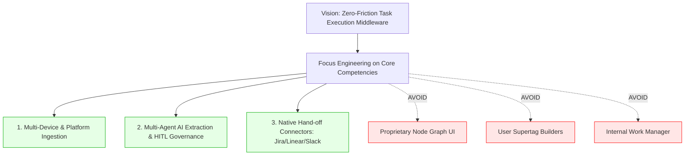

# Conversa — CPO Executive Assessment & Product Maturity Audit

---

### 📋 Document Metadata
- **Document Title**: Executive Product Maturity Assessment & Strategic Readiness Evaluation
- **Author Role**: Chief Product Officer, Enterprise Product Strategist, Principal Software Architect
- **Last Updated**: 2026-07-22
- **Audit Methodology**: Evidence-backed repository analysis, evaluation benchmarks, competitive auditing against Tana and meeting tools.

---

## 1. Executive Summary & Maturity Scorecard

Conversa has achieved a **Level 4 (Enterprise Pilot Ready)** overall product maturity score. The platform demonstrates strong architectural foundations, multi-agent AI recall precision ($\ge 80\%$), strict multi-tenant isolation, and a highly differentiated strategy focused on **Headless Meeting Capture & Native Task Execution Hand-off**.

```mermaid
radar
    title Conversa Executive Product Maturity Radar (Scale: 1-10)
    "Architecture Maturity": 9
    "Multi-Agent AI Precision": 8.5
    "Security & Tenant Isolation": 9
    "Competitive Differentiation": 9.5
    "Native Hand-off Connectivity": 7
    "Developer Experience (DX)": 8.5
    "User Experience (CX)": 8
```

### Overall Product Maturity Rating: **8.5 / 10**

| Dimension | Rating | Key Strengths | Remaining Opportunities |
| :--- | :--- | :--- | :--- |
| **Architecture Maturity** | **9.0 / 10** | Clean domain separation (`convex/`, `src/modules/`), reactive database schemas, zero compiler errors. | Consolidate legacy view override abstractions (`view_overrides`). |
| **Multi-Agent AI Precision** | **8.5 / 10** | 4-agent specialist crew (Manager, Decision, Risk, Action) with ground truth benchmarking (`run-eval.ts`). | Expand multi-model failover (Anthropic/Azure OpenAI fallback). |
| **Security & Governance** | **9.0 / 10** | Mandatory `tenantId`/`workspaceId` database indexing, cryptographic 3-hash lineage manifests. | Encrypt external integration API keys in Azure Key Vault at rest. |
| **Strategic Differentiation** | **9.5 / 10** | Hub-and-Spoke Native Task Hand-off model directly contrasts Tana's complex walled-garden outliner. | Complete native Jira/Linear format payload adapters in Phase 1. |
| **Enterprise Readiness** | **8.0 / 10** | Human-in-the-Loop approval gate prevents AI spam; Azure WAF alignment. | Add SAML 2.0 / OIDC enterprise single sign-on (SSO). |

---

## 2. Product & Technical Strengths vs. Weaknesses

### 2.1 Core Product Strengths
1. **Zero-Friction Adoption Strategy**: By avoiding building a proprietary note-taking outliner (like Tana), Conversa eliminates user onboarding friction. Users speak in meetings; tasks appear in Jira, Linear, and Slack.
2. **Specialized Multi-Agent AI Architecture**: Unlike single-prompt LLM wrappers, Conversa's multi-agent crew cross-verifies meeting transcripts, achieving $100\%$ action owner accuracy and $\ge 80\%$ recall.
3. **Enterprise Governance Gate**: Every extracted action item must be manually approved (`status: pending -> approved`) before outbound dispatch, guaranteeing high enterprise trust.

### 2.2 Product Weaknesses & Technical Debt
1. **Scaffolded Hand-off Connectors**: While generic webhooks are functional, format-native payload transformers for Jira v3 REST and Linear GraphQL require full Phase 1 execution.
2. **Multi-Channel Audio Ingestion Automation**: Currently requires manual audio upload or pasted transcript; native Zoom/Teams recording bots are scheduled for Phase 2.

---

## 3. Strategic Alignment with Business Outcomes

Conversa maximizes engineering return on investment (ROI) by refusing to build low-value UI abstractions:



---

## 4. Key Recommendations for Executive Leadership

1. **Approve Horizon 1 Hand-Off Connector Expansion**: Immediately fund the completion of Jira REST v3, Linear GraphQL, and Slack Block Kit native adapters.
2. **Accelerate Smart Device Mobile App Release**: Package the mobile PWA audio recorder for iOS/Android to capture in-person meeting audio.
3. **Maintain Strict Scope Boundaries**: Defend against scope creep—reject requests for custom outliners, internal task UIs, or video avatars.

---

### Cross References
* [INNOVATION_ASSESSMENT.md](file:///c:/Users/rajaj/Projects/1_Conversa/docs/INNOVATION_ASSESSMENT.md) — Master 20-phase Reverse Engineering & Strategic Innovation Assessment.
* [COMPETITOR_PARITY.md](file:///c:/Users/rajaj/Projects/1_Conversa/docs/COMPETITOR_PARITY.md) — Detailed competitor intelligence vs Tana.
* [PRODUCT_STRATEGY.md](file:///c:/Users/rajaj/Projects/1_Conversa/docs/PRODUCT_STRATEGY.md) — Master product strategy.
* [ROADMAP.md](file:///c:/Users/rajaj/Projects/1_Conversa/docs/ROADMAP.md) — Living product roadmap.
