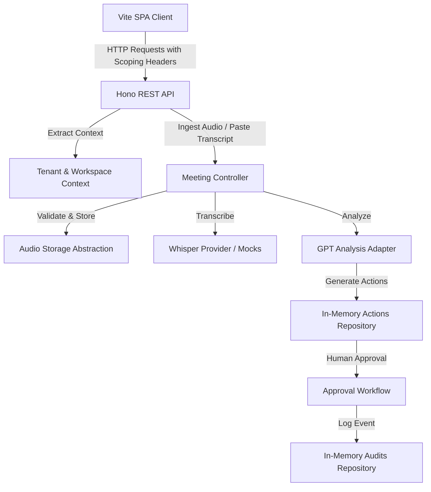

# Conversa Implementation Guide

> **Current-state notice:** Conversa is an active Buildathon prototype containing experimental, incomplete, mocked, and recently remediated functionality. It is not approved for production use, confidential meetings, regulated data, or uncontrolled multi-tenant deployment.

This document outlines the technical architecture, domain modules, and core implementation details of the Conversa prototype.

---

## 1. Runtime and Infrastructure

### Hono REST Application
The backend is a Node.js server powered by Hono (`src/server.ts`). It handles API routing, middleware execution, and error handling.
Routes are organized under:
* `/api/health` — Service health checks.
* `/api/v1/meetings` — Meeting creation, audio ingestion, and transcript analysis.
* `/api/v1/actions` — Action item listing, approval, and rejection.
* `/api/v1/audits` — Tenant-scoped audit logs.

### Vite Build and SPA Frontend
The client is a single-page application located under `src/ui/`. It is bundled using Vite and served statically. It communicates with the Hono REST API.

---

## 2. Architecture and Data Flow

---

## 3. Domain Modules and Repositories

### Repository Interfaces
The repository layers decouple database operations from controllers. Interfaces reside in `src/modules/repositories.ts` (e.g., `MeetingRepository`, `ActionRepository`, `AuditRepository`).

### In-Memory Implementations
Since persistent database drivers are mocked or planned, active repositories are implemented using in-memory Maps in `src/infrastructure/repositories/in-memory.ts`.

### Tenant/Workspace Scope Enforcement
Every repository operation accepts a tenant ID and workspace ID. It ensures that queries and mutations only impact data matching the target scope, preventing cross-tenant leakage.

### Audio Storage Abstraction
The `AudioStorageProvider` handles audio storage references. In this snapshot, raw audio buffers are stored temporarily in-memory and deleted immediately after analysis.

---

## 4. AI Integration and Core Workflows

### Transcription Contract
The transcription interface defines the `transcribe` function. Mocks and OpenAI Whisper integration are configured behind `AudioTranscriptionProvider`.

### OpenAI Adapter and Analysis
The OpenAI adapter parses meeting transcripts to extract action items, decisions, and risks. It formats the outputs into standard JSON schemas.

### Action Approval/Rejection Workflow
Extracted proposed actions are registered in the Action repository with a `PROPOSED` status. Users can trigger `Approve` or `Reject` actions, transitioning the state to `APPROVED` or `REJECTED`.

### Audit Logs and Idempotency
Every operation writes to the `AuditRepository`. Re-processing identical audio files checks checksum maps to ensure idempotency.

---

## 5. Security and Logging Policies

### Logger Sink and Recursive Redaction
The logging infrastructure is managed via `ConsoleLogger` in `src/shared/logger.ts`. Before data is output to stdout/stderr:
* Key-value objects are recursively scanned up to a depth of 10.
* Sensitive fields (e.g. keys containing `key`, `token`, `secret`, `audio`) are replaced with `[REDACTED]`.

---

## 6. Verification and Testing Framework

### Test Organization
Test files are grouped under `tests/`:
* `tests/unit/` — Unit tests for repositories, helpers, and validators.
* `tests/integration/` — Integration tests checking handler compositions and database wrappers.
* `tests/e2e/` — End-to-end tests simulating complete user workflows.

### Adversarial Runner
The adversarial test suite (`tests/integration/adversarial.spec.ts`) simulates malicious requests containing header injections and attempts to break tenant isolation boundaries.

### Smoke Test
A lightweight smoke test validates basic endpoint availability, schema validation, and simple error handling.
