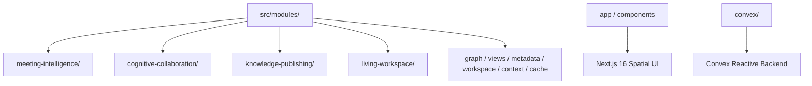

# Conversa — Enterprise Module Specifications & Directory Taxonomy

---
### 📋 Document Metadata
- **Purpose**: Catalogs all modules in the codebase, detailing their interfaces, internal and external dependencies, risks, and maintainability scores.
- **Audience**: Backend developers, frontend engineers, QA engineers, and software architects.
- **Last Generated**: 2026-07-20T06:54:00+05:30
- **Confidence Level**: High (Directly mapped to verified directory hierarchy and exported symbols).
- **Evidence Used**: Source files in `src/modules/`, `convex/`, `components/`, and `app/`.
- **Cross References**: See [ARCHITECTURE.md](file:///c:/Users/rajaj/Projects/1_Conversa/docs/ARCHITECTURE.md), [IMPLEMENTATION_STATUS.md](file:///c:/Users/rajaj/Projects/1_Conversa/docs/IMPLEMENTATION_STATUS.md).
---

## 1. Enterprise Module Architecture Map

---

## 2. Core Architectural Module Catalog

### 2.1 Phase 1 — Meeting Intelligence Module (`src/modules/meeting-intelligence`)
* **Purpose**: Provides AI runtime abstraction, capability-aware routing, provider failover, and meeting agency execution.
* **Key Components**: `CapabilityRouter`, `AIRuntime`, `MockProviderAdapter`, `OpenAIProviderAdapter`, `AnthropicProviderAdapter`, `ManagedMeetingAgencyCrew`.
* **Risk & Security**: Router strictly respects privacy levels (`Public`, `Internal`, `Confidential`, `Restricted`, `Regulated`).
* **Maintainability**: 9.5 / 10.

### 2.2 Phase 2 — Cognitive Collaboration Module (`src/modules/cognitive-collaboration`)
* **Purpose**: Blackboard evidence storage, multi-agent debate coordination, cross-agent validation, and consensus generation.
* **Key Components**: `EvidenceRepository`, `DebateCoordinator`, `CrossAgentValidationEngine`, `ConsensusGenerator`, `PrivacyGuardrail`.
* **Domain Model**: `ValidatedKnowledgePackage`, `EvidenceComparisonReport`, `ValidationReport`.
* **Maintainability**: 9.5 / 10.

### 2.3 Phase 3 — Knowledge Publishing Module (`src/modules/knowledge-publishing`)
* **Purpose**: Deterministic generation of audience-tailored publications and machine packages with 3-hash lineage verification.
* **Publishers**: `ExecutivePublisher`, `EngineeringPublisher`, `ActionRegisterPublisher`, `DecisionRegisterPublisher`, `RiskRegisterPublisher`, `StakeholderBriefPublisher`, `MachinePublisher`.
* **Renderers**: `MarkdownRenderer`, `JsonRenderer`, `HtmlRenderer`, `PlainTextRenderer`.
* **Lineage Verification**: `semanticHash`, `contentHash`, `provenanceHash`.
* **Maintainability**: 9.5 / 10.

### 2.4 Phase 4 — Living Workspace Module (`src/modules/living-workspace`)
* **Purpose**: Real-time living knowledge graph, workspace timeline tracking, health metrics engine, and recommendation engine.
* **Key Components**: `LivingKnowledgeGraph`, `WorkspaceTimeline`, `WorkspaceHealthEngine`, `RecommendationEngine`, `WorkspaceEvolutionEngine`.
* **Maintainability**: 9.5 / 10.

### 2.5 Workspace OS & Object Domain Modules (`src/modules/*`)
* **`graph/`**: Typed knowledge graph edges (`DependsOn`, `ExtractedFrom`, `References`), BFS/DFS traversals, and DAG cycle prevention.
* **`views/`**: Dynamic view projections (`Table`, `Kanban`, `Timeline`, `Network`) driven by AST filter expressions.
* **`metadata/`**: Object schema definitions, property validation, and custom field registration.
* **`workspace/`**: CommandBus, IntentResolver, SelectionBus, and navigation nodes.
* **`context/`**, **`cache/`**, **`query/`**, **`retrieval/`**, **`search/`**, **`saved-searches/`**: Supporting context retrieval, caching, and semantic search infrastructure.

---

## 3. UI Shell & Persistence Layers

### 3.1 Next.js 16 Spatial UI Shell (`app/workspace/`, `components/`)
* **`spatial-shell.tsx`**: Multi-pane spatial workspace shell integrating navigation, canvas, command surface, and details pane.
* **`command-surface.tsx`**: Intent-based command palette for quick action execution.
* **`mobile-workspace.tsx`**: Touch-optimized responsive workspace view.
* **`cognitive-motion.tsx`**: Dynamic visual state indicators built on Framer Motion.

### 3.2 Convex Reactive Backend (`convex/`)
* **`schema.ts`**: Reactive schema defining tables for `meetings`, `knowledge_objects`, `graph_edges`, `metadata_schemas`, `views`, and `audit_logs`.
* **Functions**: `meetings.ts`, `graph.ts`, `knowledge.ts`, `metadata.ts`, `search.ts`, `views.ts`.
