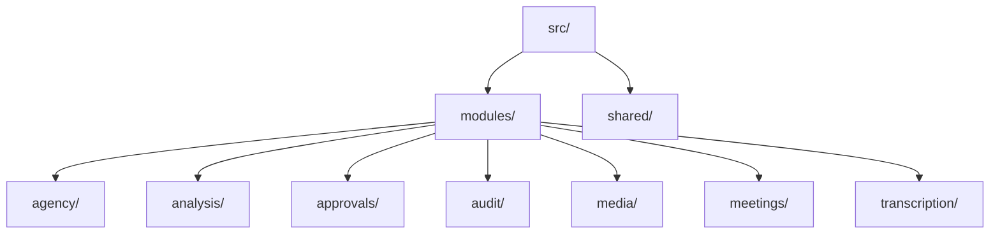

# Conversa — Module Specifications

---
### 📋 Document Metadata
- **Purpose**: Catalogs all modules in the codebase, detailing their interfaces, internal and external dependencies, risks, and maintainability scores.
- **Audience**: Backend developers, QA engineers, and software architects.
- **Last Generated**: 2026-07-13T05:20:47+05:30
- **Confidence Level**: High (Directly mapped to directory hierarchy and exports).
- **Evidence Used**: Imports, exports, and directory layout.
- **Cross References**: See [ARCHITECTURE.md](file:///c:/Users/rajaj/Projects/1_Conversa/docs/ARCHITECTURE.md), [SERVICES.md](file:///c:/Users/rajaj/Projects/1_Conversa/docs/SERVICES.md), [CODE_GUIDELINES.md](file:///c:/Users/rajaj/Projects/1_Conversa/docs/CODE_GUIDELINES.md).
- **Open Questions**: Rotation guidelines for static Bearer tokens.
- **Known Limitations**: Ephemeral DB limits long-term maintainability tracking.
- **Recommended Next Actions**: Transition static memory repositories to Convex schema definitions.
---

## 1. Code Module Directory Map

The codebase is organized in a modular structure within the `src/modules` directory, with support utilities defined under `src/shared`:

---

## 2. Module Catalog

### 2.1 Meetings Module (`src/modules/meetings`)
* **Purpose**: Core entity management for meetings, titles, schemas, types, and transcript submissions.
* **Public Interfaces**:
  * Classes: `CreateMeeting`, `GetMeeting`, `SubmitMeetingTranscript`
* **Internal Dependencies**: `src/shared/validation`, `src/shared/errors`
* **External Dependencies**: Zod, Node Crypto
* **Risk Level**: Low
* **Maintainability Score**: 9.5 / 10

### 2.2 Media & Ingestion Module (`src/modules/media`)
* **Purpose**: Manages audio validation (extensions, size constraints, MIME types) and writes to storage.
* **Public Interfaces**:
  * Classes: `UploadMeetingAudio`, `TenantScopedRefBuilder`
* **Internal Dependencies**: `src/shared/config`, `src/shared/errors`
* **External Dependencies**: None
* **Risk Level**: Medium (Susceptible to file stream buffering issues in serverless runtimes).
* **Maintainability Score**: 9.0 / 10

### 2.3 Transcription Module (`src/modules/transcription`)
* **Purpose**: Invokes Whisper or mock providers to extract plain text transcripts from stored audio.
* **Public Interfaces**:
  * Classes: `TranscribeMeetingAudio`
* **Internal Dependencies**: `src/shared/config`, `src/shared/errors`
* **External Dependencies**: OpenAI Node Library
* **Risk Level**: High (Model API latency, connection timeouts).
* **Maintainability Score**: 8.5 / 10

### 2.4 Agency Module (`src/modules/agency`)
* **Purpose**: Orchestrates the multi-agent specialist crew (Manager, Decision, Risk, and Action Specialists) and QA Reviewer loops.
* **Public Interfaces**:
  * Classes: `RunMeetingAgency`
* **Internal Dependencies**: `src/shared/observability`, `src/shared/errors`
* **External Dependencies**: Zod, Node Crypto
* **Risk Level**: High (Model hallucination or revision loops). Hard loop boundaries are in place.
* **Maintainability Score**: 9.0 / 10

### 2.5 Approvals Module (`src/modules/approvals`)
* **Purpose**: User-based approval and rejection gates for proposed actions.
* **Public Interfaces**:
  * Classes: `ApproveProposedAction`, `RejectProposedAction`
* **Internal Dependencies**: `src/shared/errors`
* **External Dependencies**: None
* **Risk Level**: Low
* **Maintainability Score**: 9.5 / 10

### 2.6 Audit Module (`src/modules/audit`)
* **Purpose**: Tracks operational transactions and resets.
* **Public Interfaces**:
  * Classes: `ListMeetingAuditEvents`
* **Internal Dependencies**: None
* **External Dependencies**: None
* **Risk Level**: Low
* **Maintainability Score**: 9.5 / 10
