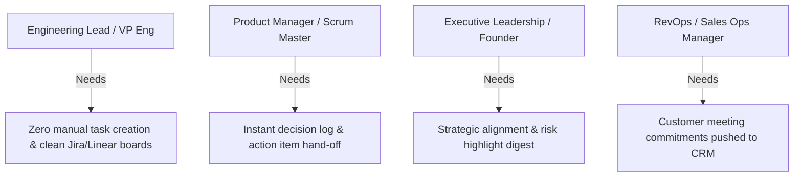
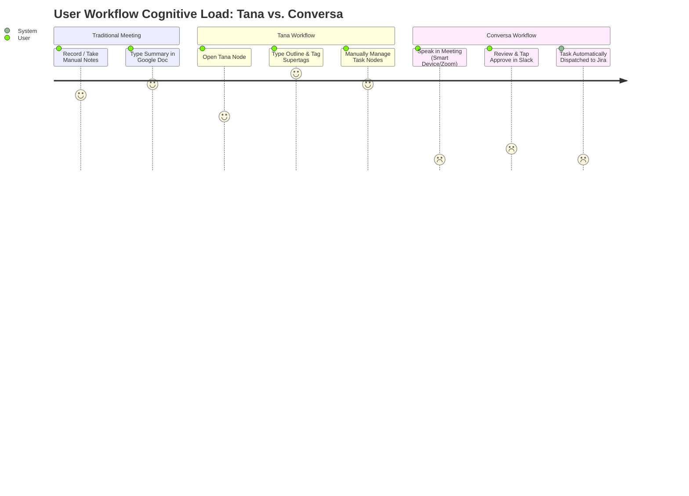

# Conversa — Persona Analysis & Jobs-To-Be-Done (JTBD) Framework

---

### 📋 Document Metadata
- **Document Title**: Enterprise Persona Analysis, Customer Journeys & Jobs-To-Be-Done Mapping
- **Author Role**: UX Research Lead, Product Marketing Strategist, Principal PM
- **Last Updated**: 2026-07-22
- **Scope & Context**: Evaluates target personas, workflows, cognitive loads, adoption friction, and JTBD functional/emotional outcomes.

---

## 1. Enterprise User Personas

---

### 1.1 Persona Deep-Dives

#### Persona 1: Alex — Engineering Lead / VP of Engineering
* **Role & Context**: Manages 4 software development teams (25 engineers). Participates in 15+ architecture, sprint planning, and post-mortem meetings per week.
* **Goals**: Ensure all architectural decisions and bug assignments discussed in meetings are immediately captured in Jira/Linear without spending hours writing tickets manually.
* **Pain Points**:
  - Action items spoken in meetings are forgotten or lost in chat logs.
  - Manual ticket creation takes 30–60 minutes after every major meeting.
  - Team members complain about missing context on assigned tasks.
* **Decision Criteria**: Must integrate directly into Jira/Linear; zero manual ticket formatting; high extraction accuracy ($\ge 80\%$).

#### Persona 2: Sarah — Principal Product Manager
* **Role & Context**: Leads cross-functional product squads across design, engineering, and product marketing.
* **Goals**: Maintain a single source of truth for key decisions and risk trade-offs made during product discovery meetings.
* **Pain Points**:
  - Linear notes in Google Docs or Notion become stale instantly.
  - Stakeholders re-open settled decisions because past rationale is buried in hours of meeting recordings.
  - Managing meeting notes in complex outliners (like Tana) adds cognitive burden.
* **Decision Criteria**: Instant decision extraction; multi-agent cross-verification; direct hand-off to Slack and Notion.

#### Persona 3: Marcus — Chief Executive Officer / Founder
* **Role & Context**: Leads a fast-growing 150-person enterprise SaaS company.
* **Goals**: Stay aligned on critical risks and strategic decisions across executive leadership meetings without attending every single call.
* **Pain Points**:
  - Suffers from information overload and meeting fatigue.
  - Receives vague meeting summaries that miss key technical risks and financial commitments.
* **Decision Criteria**: Executive risk digest; cryptographic audit lineage; multi-tenant security compliance.

---

## 2. Jobs-To-Be-Done (JTBD) Framework Matrix

| Job ID | Job Statement (When... I want to... So that I can...) | Core Persona | Conversa Capability | Destination Application Hand-Off |
| :--- | :--- | :--- | :--- | :--- |
| **JTBD-01** | **When** an architecture decision is made in a Zoom call, **I want to** automatically capture the action items and owner, **so that** tasks are created in Jira/Linear without manual typing. | Engineering Lead | Audio Capture + Action Specialist Agent + HITL Approval Gate | **Jira / Linear** |
| **JTBD-02** | **When** a client commitment is made during a sales call on a mobile phone, **I want to** record the audio on my smart device, **so that** follow-up tasks are immediately pushed to Slack and CRM. | RevOps / Sales Manager | Smart Device Audio Capture + HITL Gate | **Slack / HubSpot / Salesforce** |
| **JTBD-03** | **When** a critical technical risk is raised in a sprint post-mortem, **I want** the system to flag the risk and rationale, **so that** engineering leads can mitigate it before launch. | VP of Engineering | Risk Specialist Agent + Executive Digest | **Slack / Notion / Azure DevOps** |
| **JTBD-04** | **When** multiple stakeholders discuss product scope, **I want to** log the final decision and rationale with audit lineage, **so that** team members cannot re-open settled decisions without evidence. | Principal PM | Decision Specialist Agent + Cryptographic 3-Hash Lineage | **Notion / Confluence / Google Docs** |

---

## 3. Cognitive Load & Workflow Comparison

---

### Cross References
* [INNOVATION_ASSESSMENT.md](file:///c:/Users/rajaj/Projects/1_Conversa/docs/INNOVATION_ASSESSMENT.md) — Master 20-phase Reverse Engineering & Strategic Innovation Assessment.
* [PRODUCT_STRATEGY.md](file:///c:/Users/rajaj/Projects/1_Conversa/docs/PRODUCT_STRATEGY.md) — Product vision & strategy.
* [COMPETITOR_PARITY.md](file:///c:/Users/rajaj/Projects/1_Conversa/docs/COMPETITOR_PARITY.md) — Competitor intelligence vs Tana.
* [CAPABILITY_MATRIX.md](file:///c:/Users/rajaj/Projects/1_Conversa/docs/CAPABILITY_MATRIX.md) — Capability inventory.
