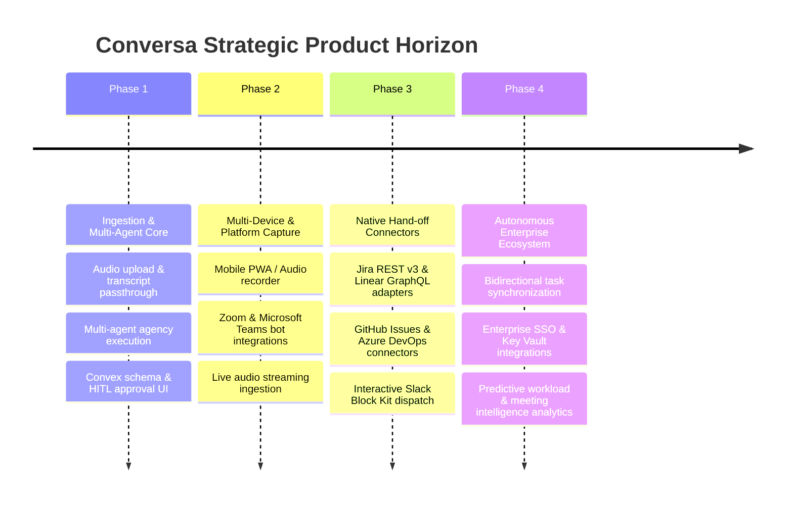

# Conversa — Universal Product Strategy & Strategic Master Plan

---

### 📋 Document Metadata
- **Document Title**: Conversa Universal Product Strategy & Strategic Master Plan
- **Author Role**: Chief Product Officer, Enterprise Product Strategist, Principal PM
- **Last Updated**: 2026-07-22
- **Maturity Stage**: Scale-Up & Enterprise Integration Phase
- **Scope & Context**: Establishes product vision, market strategy, jobs-to-be-done, platform boundaries, and strategic differentiators.

---

## 1. Product Vision, Mission & Strategic Positioning

### 1.1 Vision Statement
To become the global enterprise neural network for conversational task execution—turning spoken human dialogue from smart devices and video meetings into structured, verified, and automated work across every major enterprise application.

### 1.2 Mission Statement
Conversa eliminates the administrative tax of modern meetings by automatically capturing audio, orchestrating multi-agent AI analysis, enforcing human-in-the-loop governance, and seamlessly dispatching format-native execution payloads to Jira, Linear, GitHub Issues, Azure DevOps, Notion, and Slack.

### 1.3 Strategic Differentiators
1. **Hub-and-Spoke Native Task Execution**: Instead of forcing teams into a new walled-garden task manager or note-taking outliner, Conversa delivers format-aware task hand-off directly into target tools.
2. **Multi-Agent Specialist Agency**: Employs a multi-agent crew (Decision Specialist, Risk Specialist, Action Specialist, Manager Agent) that cross-evaluates meeting transcripts to achieve $\ge 80\%$ recall and $100\%$ owner identification.
3. **Enterprise Human-in-the-Loop Governance**: Every proposed action passes through an explicit audit and approval gate before system publication or outbound dispatch, guaranteeing zero unverified AI noise in enterprise project boards.
4. **Multi-Channel Audio Ingestion**: Captures meetings seamlessly across mobile devices, smart wearables, desktop microphones, audio uploads, and Zoom/Teams/Meet platform webhooks.

```mermaid
graph LR
    subgraph Ingestion ["Multi-Channel Ingestion"]
        I1[Mobile App / Smart Device]
        I2[Zoom / Teams / Meet Bots]
        I3[Audio File Uploads / Transcripts]
    end

    subgraph Core ["Conversa Multi-Agent Intelligence Engine"]
        A1[Multi-Agent QA & Extraction]
        A2[Cryptographic 3-Hash Lineage]
        A3[Human Approval & Governance Gate]
    end

    subgraph Hand-Off ["Native Task Hand-Off Engine"]
        H1[Jira REST v3 Adapter]
        H2[Linear GraphQL Adapter]
        H3[GitHub Issues API]
        H4[Azure DevOps Work Items]
        H5[Slack Interactive Block Kit]
    end

    Ingestion --> Core --> Hand-Off
```

---

## 2. Market Positioning & Competitive Advantage

### 2.1 Target Segments & Customer Profiles
* **Primary Segment**: Mid-market to Enterprise Software Engineering & Product Organizations (50–5,000 employees).
* **Secondary Segment**: Cross-functional Enterprise Operations, RevOps, and Executive Leadership teams.
* **Tertiary Segment**: Technical Consultancies and Professional Services Agencies managing high client meeting volumes.

### 2.2 Competitive Intelligence Overview

| Competitor Category | Key Players | Competitor Model | Conversa Advantage |
| :--- | :--- | :--- | :--- |
| **All-in-One Knowledge OS** | Tana (`tana.inc`), Notion, Obsidian | Walled garden outliner; requires users to manually take notes, configure supertags, and work inside their UI. | **Zero Friction**: Captures audio automatically and hands tasks directly off to native tools (Jira, Linear, GitHub). No new UI to adopt. |
| **Meeting Recorders** | Otter.ai, Fathom, Fireflies.ai | Passive recording & linear transcription; basic LLM summary without strict governance or multi-agent validation. | **Multi-Agent Extraction & HITL Governance**: Specialized AI specialists cross-verify tasks and require human approval before task dispatch. |
| **Local Note Assistants** | Granola.so, Mac Whispers | Individual desktop app; non-collaborative, lacks enterprise multi-tenancy and audit compliance. | **Enterprise Security & Multi-Tenancy**: Built on Convex relational schema with tenant/workspace isolation and immutable audit logs. |

---

## 3. Core Product Strategy Principles (Operating Guidelines)

1. **Evidence Over Opinion**: Product decisions are validated against empirical evaluation benchmarks (e.g. `run-eval.ts` recall and precision scores).
2. **Product Outcomes Over Feature Count**: Measure success by task hand-off execution rate and time saved, not by total lines of code or UI clutter.
3. **Simplicity & Anti-Bloat**: Say NO to building proprietary outliners, custom supertag builders, or internal project management UIs. Re-use existing tools.
4. **Human-in-the-Loop Integrity**: AI proposes; humans approve; systems execute. No automated task dispatch occurs without verified human authorization.
5. **Format-Aware Integration First**: Every extracted action item must be deliverable in the precise, native JSON/GraphQL payload structure required by the target application.

---

## 4. Multi-Phase Product Lifecycle Strategy

---

### Cross References
* [INNOVATION_ASSESSMENT.md](file:///c:/Users/rajaj/Projects/1_Conversa/docs/INNOVATION_ASSESSMENT.md) — Master 20-phase Reverse Engineering & Strategic Innovation Assessment.
* [COMPETITOR_PARITY.md](file:///c:/Users/rajaj/Projects/1_Conversa/docs/COMPETITOR_PARITY.md) — Detailed comparison against Tana and meeting tools.
* [PERSONA_JTBD.md](file:///c:/Users/rajaj/Projects/1_Conversa/docs/PERSONA_JTBD.md) — User personas and Jobs-to-be-Done mapping.
* [ROADMAP.md](file:///c:/Users/rajaj/Projects/1_Conversa/docs/ROADMAP.md) — Living product roadmap with RICE & Kano prioritization.
