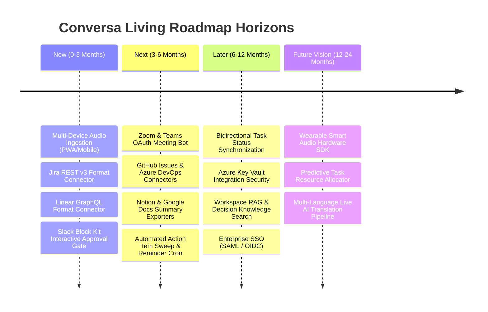

# Conversa — Living Product & Technology Roadmap (2026–2027)

---

### 📋 Document Metadata
- **Document Title**: Conversa Living Product Roadmap & Feature Prioritization Framework
- **Author Role**: Chief Product Officer, Technical Program Manager, Principal PM
- **Last Updated**: 2026-07-22
- **Prioritization Lenses**: RICE (Reach, Impact, Confidence, Effort), Kano Model, MoSCoW, Pareto (80/20), Cost of Delay

---

## 1. Executive Summary & Strategic Horizon Map

Conversa's strategic North Star is to **turn meeting conversations on smart devices and conferencing platforms into verified, executed work in native enterprise applications.**

---

## 2. Prioritization Framework & RICE Scoring Matrix

Every initiative is evaluated using RICE ($RICE = \frac{\text{Reach} \times \text{Impact} \times \text{Confidence}}{\text{Effort}}$), Kano Model, and MoSCoW classification:

| Initiative Name | RICE Score | Reach (1-10) | Impact (1-5) | Confidence (%) | Effort (Person-Wks) | MoSCoW | Kano Category | Customer & Business Outcome |
| :--- | :--- | :--- | :--- | :--- | :--- | :--- | :--- | :--- |
| **Jira REST v3 Format Adapter** | **18.0** | 9 | 5 | 100% | 2.5 | **Must Have** | Performance | Automates ticket creation for 80% of engineering teams; saves 45 mins/meeting. |
| **Linear GraphQL Adapter** | **16.0** | 8 | 5 | 100% | 2.5 | **Must Have** | Performance | Captures high-growth startup engineering teams; instant Linear issue creation. |
| **Interactive Slack Approval Gate**| **14.4** | 9 | 4 | 90% | 2.0 | **Must Have** | Delighter | Enables single-tap approval of meeting tasks directly inside Slack. |
| **Mobile PWA Audio Recorder** | **12.0** | 8 | 4 | 75% | 2.0 | **Should Have** | Basic | Captures in-person meetings and voice notes on iOS/Android smartphones. |
| **Zoom & Teams OAuth Bot** | **10.8** | 9 | 4 | 75% | 2.5 | **Should Have** | Basic | Zero-touch meeting join; automatically captures video calls. |
| **GitHub Issues Adapter** | **9.6** | 8 | 3 | 100% | 2.5 | **Should Have** | Performance | Seamless hand-off to open-source and developer-first teams. |
| **Azure DevOps Connector** | **7.2** | 6 | 4 | 90% | 3.0 | **Could Have** | Performance | Unlocks enterprise Microsoft software development accounts. |
| **Workspace RAG Decision Search** | **6.4** | 7 | 3 | 80% | 2.5 | **Could Have** | Delighter | Allows team members to semantic-search past meeting rationale. |

---

## 3. Detailed Horizon Evolution Plan

### 3.1 Horizon 1: NOW (0 – 3 Months) — Core Ingestion & Primary Native Connectors
* **Primary Objective**: Deliver zero-friction meeting capture and format-native task hand-off for Jira, Linear, and Slack.
* **Key Deliverables**:
  1. **Jira REST v3 Payload Connector**: Transform approved `ActionItem` into Jira issue ADF payloads (`src/modules/integrations/jira.ts`).
  2. **Linear GraphQL Connector**: Transform approved `ActionItem` into Linear GraphQL mutation inputs.
  3. **Slack Interactive Block Kit Approval Gate**: Deliver interactive Slack notifications with "Approve & Dispatch" buttons.
  4. **Mobile PWA Audio Recording**: Optimize audio capture UI for iOS and Android smart device browsers.

### 3.2 Horizon 2: NEXT (3 – 6 Months) — Platform Automation & Cloud Security
* **Primary Objective**: Automate meeting join workflows and harden enterprise cloud security.
* **Key Deliverables**:
  1. **Zoom & Microsoft Teams OAuth Integration**: Receiver service allowing Conversa bots to record virtual calls.
  2. **GitHub Issues & Azure DevOps Adapters**: Complete native hand-off connector suite for enterprise engineering.
  3. **Azure Key Vault Security Integration**: Encrypt integration OAuth tokens and API credentials at rest.
  4. **Notion & Google Docs Exporters**: Export structured meeting decision logs and summaries to team documentation tools.

### 3.3 Horizon 3: LATER (6 – 12 Months) — Bidirectional Sync & Enterprise Scaling
* **Primary Objective**: Achieve full bidirectional status synchronization and enterprise compliance.
* **Key Deliverables**:
  1. **Bidirectional Task Synchronization**: When a task is marked "Done" in Jira/Linear, update the Conversa action item status.
  2. **Enterprise Single Sign-On (SAML 2.0 / OIDC)**: Enterprise identity integration via Clerk / Azure AD.
  3. **Workspace RAG & Knowledge Search**: Advanced semantic vector search across all historical meeting decisions and risks.

### 3.4 Horizon 4: FUTURE VISION (12 – 24 Months) — Autonomous Enterprise Ecosystem
* **Primary Objective**: Autonomous intelligence across hardware and global teams.
* **Key Deliverables**:
  1. **Wearable Smart Audio Hardware Integration**: Integration SDK for wearable microphones (e.g. Humane, Limitless, Apple Watch).
  2. **Multi-Language Live Translation Pipeline**: Real-time cross-language transcription and task translation.

---

## 4. What We Will WON'T Build (Retired & Postponed Initiatives)

> [!CAUTION]
> **Items Permanently Excluded from the Roadmap**:
> 1. **Proprietary Node Graph Editor / Tana Clone**: Explicitly rejected to avoid competing with outliners and adding UI bloat.
> 2. **End-User Custom Supertag Builder**: Excluded; fixed enterprise schemas provide zero-friction setup.
> 3. **Internal Task Management Suite**: Excluded; tasks are handed off to native tools (Jira, Linear, GitHub).
> 4. **Video Processing & Avatars**: Excluded under Audio-First ADR 0002.

---

### Cross References
* [INNOVATION_ASSESSMENT.md](file:///c:/Users/rajaj/Projects/1_Conversa/docs/INNOVATION_ASSESSMENT.md) — Master 20-phase Reverse Engineering & Strategic Innovation Assessment.
* [COMPETITOR_PARITY.md](file:///c:/Users/rajaj/Projects/1_Conversa/docs/COMPETITOR_PARITY.md) — Competitive positioning vs Tana.
* [PRODUCT_STRATEGY.md](file:///c:/Users/rajaj/Projects/1_Conversa/docs/PRODUCT_STRATEGY.md) — Strategic master plan.
* [STRATEGIC_GAP_ANALYSIS.md](file:///c:/Users/rajaj/Projects/1_Conversa/docs/STRATEGIC_GAP_ANALYSIS.md) — Gap analysis.
