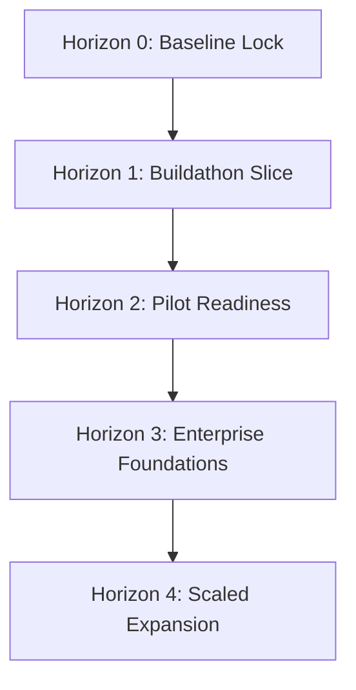

# Conversa — Product & Technology Roadmap

---
### 📋 Document Metadata
- **Purpose**: Canonical product and technology roadmap outlining current status, development horizons, and milestones.
- **Audience**: Engineering leadership, product managers, investors, and client partners.
- **Last Generated**: 2026-07-13T05:20:47+05:30
- **Confidence Level**: High (Directly reconciled with active buildathon results and execution backlog).
- **Evidence Used**: Root files, `/docs/roadmap` execution guides, and passing agency tests.
- **Cross References**: See [PROJECT.md](file:///c:/Users/rajaj/Projects/1_Conversa/docs/PROJECT.md), [CURRENT_STATE.md](file:///c:/Users/rajaj/Projects/1_Conversa/docs/CURRENT_STATE.md), [KNOWN_ISSUES.md](file:///c:/Users/rajaj/Projects/1_Conversa/docs/KNOWN_ISSUES.md).
- **Open Questions**: Final decision on using Convex vs. Cloudflare D1/KV for serverless pilot databases.
- **Known Limitations**: Ephemeral persistence blocks early user trials.
- **Recommended Next Actions**: Approve Horizon 1 migration from in-memory repositories to Convex.
---

## 1. Executive Summary & North Star

Conversa's ultimate goal (North Star) is to **turn meeting conversations into governed, traceable, and completed work.** 

This roadmap outlines the journey from our currently verified, in-memory Buildathon MVP vertical slice to a scaled, secure, multi-tenant enterprise intelligence platform.

---

## 2. Roadmap Horizons

### Horizon 0 — Baseline Lock and Documentation Reconciliation (Completed)
* **Goal**: Stabilize the Hono/Vite codebase, ensure all regression test suites pass, and audit security containment.
* **Milestones**:
  - 100% clean TypeScript build without compiler or linter errors.
  - Integration and E2E security isolation gates validated on every commit.
  - Reconcile and clean up historical/obsolete Next.js documentation.

### Horizon 1 — Buildathon-Complete Vertical Slice (In Progress)
* **Goal**: Deliver a repeatable, demonstrable, and externally hosted end-to-end slice running on serverless environments.
* **Milestones**:
  - **Convex Persistence**: Replace volatile in-memory maps with Convex reactive database persistence.
  - **BYOK Key Management**: Secure client-side routing and verification of OpenAI keys.
  - **Linkup Grounding**: Hook up external search engines to attach grounding links to extracted meeting topics and actions.
  - **Downstream Integrations**: Send meeting action digests to Slack channels.
  - **Execution Scheduler**: Configure a cron sweep to identify unresolved actions every morning.

### Horizon 2 — Design-Partner Pilot Readiness
* **Goal**: Secure and stabilize the platform for 3 to 5 early corporate partners.
* **Milestones**:
  - **Clerk Authentication**: Integrate Clerk/JWT signature verification in API middlewares.
  - **Idempotency Connectors**: Safe retries and database transaction guards for mutations.
  - **Product Analytics**: Track user overrides, approvals, and rejections.

### Horizon 3 — Reliability and Enterprise Foundations
* **Goal**: Hardening for production scale and corporate compliance audits.
* **Milestones**:
  - **Model Failover**: Degraded-mode support (failover to Anthropic/Claude if OpenAI is down).
  - **Tamper-Evident Auditing**: Lock down audit tables with read-only cryptographic verification.
  - **Resilience Engineering**: High-load simulations and automated disaster-recovery drills.

### Horizon 4 — Scaled Product & Modality Expansion
* **Goal**: Commercial expansion based on explicit client demand.
* **Milestones**:
  - Real-time websocket audio streaming and live transcription.
  - Direct connectors to Jira, Salesforce, and GitHub.
  - Workspace-level memory and corporate RAG knowledge graphs.

---

## 3. Scope Exclusions (Out-of-Scope)
* **Video Capture & Processing**: Video uploads return `415 UNSUPPORTED_MEDIA_TYPE` (per [ADR 0002](file:///c:/Users/rajaj/Projects/1_Conversa/docs/adr/0002-audio-first-media-scope.md)).
* **Custom Auth UI**: Clerk/Auth0 widgets are preferred over custom authentication page implementations.
* **Multi-Model Routing in Horizon 1**: Locked strictly to OpenAI models or verified mocks.

---

## 4. Key Roadmap Risks & Mitigations
1. **Model API Outages**: Mitigated by offline-first mocks in dev/test, and planned multi-model routing in Horizon 3.
2. **Infinite Revision Loops**: Hard loop limit (max 1 retry) implemented in the specialist crew coordinator to prevent runaway costs.
3. **Data Loss**: Mitigated by migrating the persistence layer from volatile memory to Convex.
