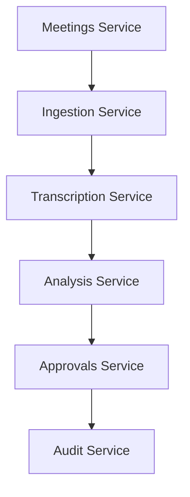

# Conversa — Services Architecture

---
### 📋 Document Metadata
- **Purpose**: Defines the logical service components, their public interfaces, dependencies, and scaling rules.
- **Audience**: Platform engineers, solution architects, and site reliability engineers.
- **Last Generated**: 2026-07-13T05:20:47+05:30
- **Confidence Level**: High (Derived from core module partitions and REST endpoints).
- **Evidence Used**: Core modules under `src/modules` and router configuration.
- **Cross References**: See [ARCHITECTURE.md](file:///c:/Users/rajaj/Projects/1_Conversa/docs/ARCHITECTURE.md), [MODULES.md](file:///c:/Users/rajaj/Projects/1_Conversa/docs/MODULES.md), [API.md](file:///c:/Users/rajaj/Projects/1_Conversa/docs/API.md).
- **Open Questions**: Database partitioning keys for multi-region scale.
- **Known Limitations**: All services are packaged as a single deployable process in this release.
- **Recommended Next Actions**: Draft modular service deployment rules for separate workers.
---

## 1. Service Map & Interfaces

---

## 2. Service Roster

### 2.1 Meetings Service
* **Description**: Coordinates the lifecycle and properties of meetings.
* **Public Interfaces**:
  * `CreateMeeting.execute(body, correlationId)`
  * `GetMeeting.execute(meetingId)`
* **Dependencies**: `MeetingRepo`, `AuditRepo`
* **Scaling Rules**: Read-heavy. Benefit from caching layers (Redis/Cloudflare KV) on meeting lookups.

### 2.2 Audio Ingestion Service
* **Description**: Validates media files, enforces maximum payload thresholds, hashes files for deduplication, and persists files in secure storage.
* **Public Interfaces**:
  * `UploadMeetingAudio.execute(meetingId, fileData, correlationId)`
* **Dependencies**: `AudioAssetRepo`, `InMemoryAudioStorage` (or R2)
* **Scaling Rules**: High network bandwidth consumption. Ingestion limits should be offloaded to edge workers.

### 2.3 Transcription Service
* **Description**: Extracts raw audio bytes, interfaces with Whisper API, processes transcription, and saves output.
* **Public Interfaces**:
  * `TranscribeMeetingAudio.execute(meetingId, correlationId)`
* **Dependencies**: `TranscriptRepo`, `AudioTranscriptionProvider` (Whisper API / Fake)
* **Scaling Rules**: High-latency external request. Requires asynchronous queuing or long execution timeouts (e.g. Cloudflare Workers tail limits).

### 2.4 Meeting Analysis Service (Agency)
* **Description**: Coordinates the multi-agent specialist crew (Manager, Decision, Risk, and Action Specialists) and QA Reviewer loops.
* **Public Interfaces**:
  * `RunMeetingAgency.execute(meetingId, correlationId, options)`
  * `GetMeetingAnalysis.execute(meetingId)`
* **Dependencies**: `MeetingAnalysisRepo`, `AgencyRunRepo`, `MeetingAnalysisProvider` (OpenAI GPT / Fake)
* **Scaling Rules**: Compute and model token heavy. Demands rate limiters to prevent API credit exhaustion.

### 2.5 Approvals Service
* **Description**: Human-in-the-loop gating for proposed action items.
* **Public Interfaces**:
  * `ApproveProposedAction.execute(actionId, correlationId)`
  * `RejectProposedAction.execute(actionId, reason, correlationId)`
* **Dependencies**: `MeetingAnalysisRepo`, `AuditRepo`
* **Scaling Rules**: Low transaction volume, high consistency requirements. Enforces locking mechanisms on database writes.

### 2.6 Audit & Governance Service
* **Description**: Immutable append-only log record keeper.
* **Public Interfaces**:
  * `ListMeetingAuditEvents.execute(meetingId)`
  * `RepoAuditPort.record(event)`
* **Dependencies**: `AuditRepo`
* **Scaling Rules**: Append-heavy. Needs partition strategies by tenant and workspace.
