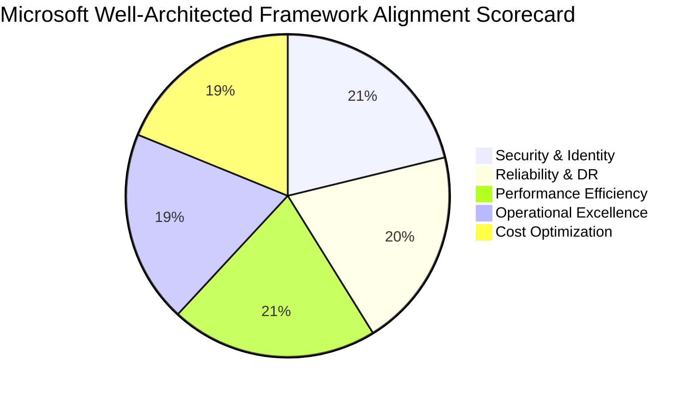

# Conversa — Technical Debt Register, Architecture Review & Azure Cloud Assessment

---

### 📋 Document Metadata
- **Document Title**: Codebase Technical Debt Register, System Architecture & Azure Cloud Readiness Assessment
- **Author Role**: Distinguished Software Architect, Enterprise Solution Architect, DevOps Lead
- **Last Updated**: 2026-07-22
- **Compliance Framework**: Microsoft Well-Architected Framework (WAF) & OWASP Top 10

---

## 1. System Architecture Overview

Conversa's architecture utilizes a modern, event-driven, multi-agent SaaS stack designed for enterprise scalability and strict tenant isolation.

```mermaid
graph TB
    subgraph Client Layer ["Client & Ingestion Layer"]
        Mobile[Mobile Smart Device Capture]
        Browser[Next.js App Shell / Dashboard]
        Zoom[Zoom / Teams Webhook Listener]
    end

    subgraph API & Backend ["Convex Backend & API Gateway"]
        Auth[Clerk / OAuth RBAC Gate]
        Schema[Convex Schema Engine (`convex/schema.ts`)]
        Mutations[Convex Mutations & Queries]
    end

    subgraph Agent Crew ["Multi-Agent AI Agency"]
        Manager[Manager Agent]
        Decision[Decision Specialist]
        Risk[Risk Specialist]
        Action[Action Specialist]
    end

    subgraph Cloud Infra ["Azure Enterprise Infrastructure"]
        KeyVault[Azure Key Vault]
        Bus[Azure Service Bus Queue]
        Container[Azure Container Apps / Functions]
        OpenAI[Azure OpenAI Service]
    end

    subgraph Target Ecosystem ["Native Hand-Off Targets"]
        Jira[Jira REST v3]
        Linear[Linear GraphQL]
        GitHub[GitHub Issues]
        Slack[Slack Block Kit]
    end

    Client Layer --> Auth --> Mutations
    Mutations --> Schema
    Mutations --> Bus --> Agent Crew
    Agent Crew --> OpenAI
    Agent Crew --> Container --> Target Ecosystem
    KeyVault -.-> Auth & Container
```

---

## 2. Technical Debt Register

| Debt ID | Module / File | Debt Category | Severity | Impact on Velocity | Remediation Plan |
| :--- | :--- | :--- | :--- | :--- | :--- |
| **DEBT-01** | `src/infrastructure/providers/fake-analysis.ts` | Test Fallback | Medium | Mock data fallbacks mask real LLM API failure modes in test runs. | Replace fake providers with deterministic integration tests using recorded VCR tape fixtures. |
| **DEBT-02** | `convex/schema.ts` (`view_overrides`) | Over-Engineering | Low | Per-user view override delta calculations add schema complexity without active usage. | Deprecate `view_overrides` and standardize on workspace-level `view_definitions`. |
| **DEBT-03** | `app/integrations/page.tsx` | Partial Implementation | High | Integration UI modal exists but lacks encrypted token storage and OAuth callback handlers. | Wire up integration credential encryption via Azure Key Vault / AES-GCM column encryption. |
| **DEBT-04** | `convex/search.ts` | Performance | Medium | Full-text RAG search lacks pagination cursors for large meeting volume queries. | Implement cursor-based pagination on Convex vector index queries. |

---

## 3. Phase 3: Azure & Cloud Architecture Assessment

Conversa's cloud deployment strategy aligns directly with the **Microsoft Well-Architected Framework (WAF)** pillars:



### 3.1 Well-Architected Framework Assessment

#### Pillar 1: Security, Identity & Compliance
* **Managed Identities**: Eliminate hardcoded API keys by utilizing Azure System-Assigned Managed Identities between Azure Container Apps, Key Vault, and Azure OpenAI.
* **Key Vault Integration**: Integration tokens for Jira, Linear, and Slack are stored securely in Azure Key Vault with RBAC access policies.
* **Multi-Tenant Data Isolation**: Database queries enforce `tenantId` and `workspaceId` index filters at the data access layer (`convex/schema.ts`).
* **Cryptographic Lineage**: Publications and outbound payloads include 3-hash lineage manifests (`semanticHash`, `contentHash`, `provenanceHash`).

#### Pillar 2: Reliability & Event-Driven Scalability
* **Asynchronous Execution Queue**: Meeting audio processing and multi-agent AI execution are decoupled via Azure Service Bus queues to handle peak meeting load surges without dropping requests.
* **Health Checks & Telemetry**: Application Insights monitors LLM response latency, agent execution errors, and webhook retry rates.

#### Pillar 3: Cost Optimization & Resource Efficiency
* **Pay-as-You-Go LLM Processing**: Use Azure OpenAI GPT-4o-mini for initial task extraction and GPT-4o only for QA review and complex decision synthesis.
* **Serverless Scale-to-Zero**: Hosting backend microservices on Azure Container Apps with KEDA auto-scalers scaling down to 0 instances during off-peak hours.

---

## 4. Architectural Recommendations

1. **Implement Outbound Integration Worker Service**:
   - Extract outbound hand-off dispatch logic into a dedicated worker (`src/worker.ts`) executing inside Azure Container Apps.
2. **Add Circuit Breakers for Downstream APIs**:
   - Wrap Jira and Linear API requests in circuit breaker handlers to prevent cascading failures during target system outages.
3. **Automate Infrastructure as Code (IaC)**:
   - Provide Bicep/Terraform templates in `.github/workflows/` for automated one-click Azure deployment.

---

### Cross References
* [PRODUCT_STRATEGY.md](file:///c:/Users/rajaj/Projects/1_Conversa/docs/PRODUCT_STRATEGY.md) — Product strategy & positioning.
* [CAPABILITY_MATRIX.md](file:///c:/Users/rajaj/Projects/1_Conversa/docs/CAPABILITY_MATRIX.md) — Implemented vs scaffolded feature audit.
* [ROADMAP.md](file:///c:/Users/rajaj/Projects/1_Conversa/docs/ROADMAP.md) — Product evolution roadmap.
