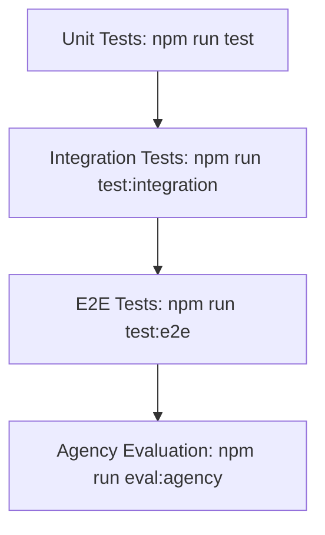

# Conversa — Operational Workflows & Runbooks

---
### 📋 Document Metadata
- **Purpose**: Outlines developer onboarding, testing patterns, deployments, releases, support diagnostics, and incident runbooks.
- **Audience**: Backend engineers, QA architects, site reliability engineers, and support specialists.
- **Last Generated**: 2026-07-13T05:20:47+05:30
- **Confidence Level**: High (Directly represents development tasks, testing targets, and REST endpoints).
- **Evidence Used**: Package scripts, Vitest configurations, and REST admin routes.
- **Cross References**: See [DEPLOYMENT.md](file:///c:/Users/rajaj/Projects/1_Conversa/docs/DEPLOYMENT.md), [TROUBLESHOOTING.md](file:///c:/Users/rajaj/Projects/1_Conversa/docs/TROUBLESHOOTING.md).
- **Open Questions**: Automated alerts on Slack during incident escalations.
- **Known Limitations**: Ephemeral DB locks block real-world incident simulations.
- **Recommended Next Actions**: Enforce TLS and HTTPS verification at deployment gateway.
---

## 1. Developer Onboarding & Local Flow

### 1.1 Local Workspace Setup
1. Clone the workspace.
2. Install dependencies:
   ```bash
   npm ci
   ```
3. Copy environment configuration:
   ```bash
   copy .env.example .env.local
   ```
4. Run local server:
   ```bash
   npm run dev
   ```

### 1.2 Development Loop
Before pushing any code changes, developers must execute:
- **Lint Check**: `npm run lint` (Checks linter rules; max-warnings must be 0).
- **Type Safety**: `npm run typecheck` (Checks TypeScript compilation).
- **Unit & Integration Tests**: `npm run test` and `npm run test:integration`.
- **E2E Checks**: `npm run test:e2e` (Ensures api integrity).

---

## 2. QA & Test Execution Workflow

The testing lifecycle is categorized into three sequential blocks:


- **Agency Evaluation**: Validates precision and recall targets across 25 synthetic cases, ensuring no cross-tenant leaks.

---

## 3. Incident Response & Support Runbooks

### 3.1 Troubleshooting Escalated Agency Steps
If an agency specialist step status transitions to `ESCALATED`:
1. Find the `runId` and `stepId` from the Client Trace UI (or `GET /api/v1/agency/runs`).
2. Inspect the `escalationReason` to understand the policy violation (e.g. missing due date on high priority task).
3. If the blocker is resolved manually or corrected, trigger a retry:
   ```bash
   POST /api/v1/agency/runs/:runId/steps/:stepId/retry
   ```
   This resets the step status to `COMPLETED` and changes the run status to `RUNNING` to resume execution.

### 3.2 Tenant Isolation Leak Remediation
If an audit event or log indicates that tenant data boundary isolation was breached:
1. Locate the leakage scope and identify affected workspaces.
2. Under admin credentials, clear the tenant workspace immediately to purge data from memory:
   ```bash
   POST /api/v1/workspace/reset
   ```
   *Headers: `X-Actor-Id: admin-user`, `Authorization: Bearer <admin-token>`*
3. Review audit records using `GET /api/v1/meetings/:meetingId/audit` to compile forensic reports.
