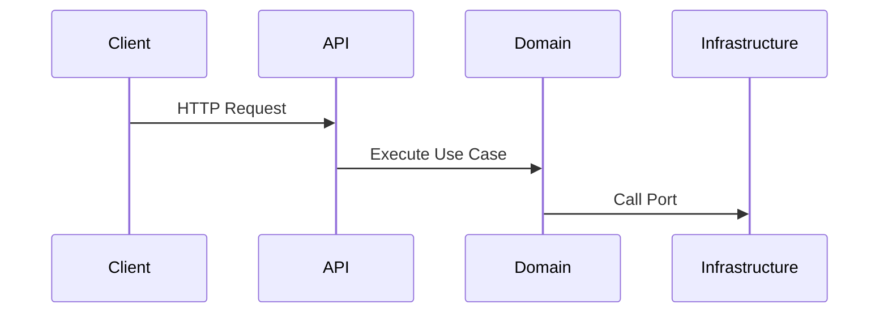

# ARCHITECTURE ANALYSIS

## Executive Summary
Conversa employs a Hexagonal Architecture (Ports and Adapters) combined with Domain-Driven Design (DDD) within a Next.js Edge/Serverless context.

## Scope
- Architectural Styles & Patterns
- Dependency and Execution Flow
- Module Relationships and Bounded Contexts

## Evidence Sources
- `src/modules/*/domain/` (Ports & Entities)
- `src/infrastructure/` (Adapters)
- `src/app/index.ts` (Composition Root)

## Detailed Analysis
The codebase is partitioned into distinct bounded contexts.

## Architecture Diagrams

## Tables
| Layer | Implementation | Purpose |
|-------|----------------|---------|
| API | Hono | Routing & Auth |
| Domain | `src/modules` | Core Logic |
| Infra | `src/infrastructure` | Adapters |

## Dependency Maps & Capability Maps
- Core domain has ZERO dependencies on outer infrastructure.

## Observations & Findings
- **Verified**: Manual Dependency Injection is utilized in `src/app/index.ts`.

## Risks
- **Complexity Overhead**: High cognitive load for junior developers.

## Assumptions & Unknowns
- **Assumption**: Ports and Adapters pattern is strictly adhered to in all upcoming PRs.
- **Unknown**: Potential cyclic dependencies between modules if domain events aren't used correctly.

## Recommendations
- Implement a static analysis tool (e.g. dependency-cruiser) to enforce module boundaries.

## Confidence Level
- **Confidence Level**: High.

## Traceability to implementation evidence
- `src/infrastructure/repositories/convex.ts` implements the interface from `src/modules/agency/domain/repositories.ts`.
