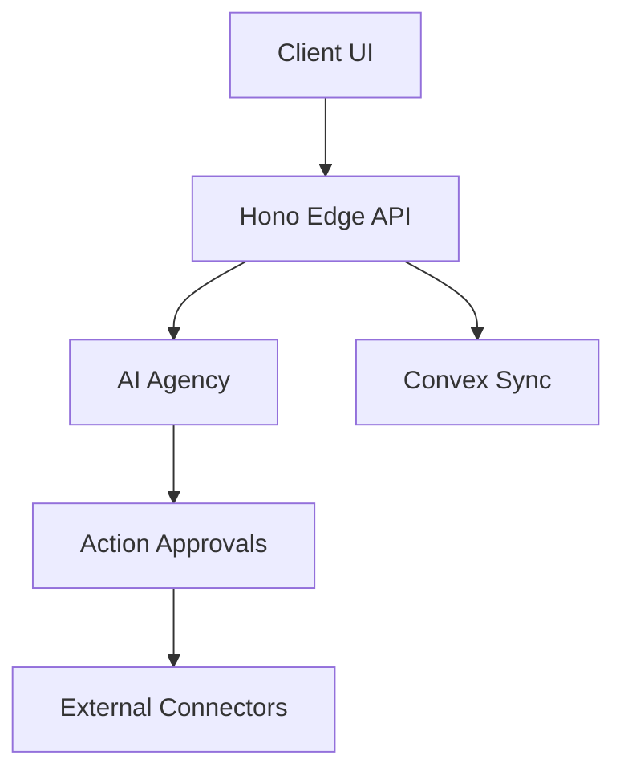

# AS-IS SYSTEM OVERVIEW

## Executive Summary
Conversa is an "Audio-to-Governed-Action" platform designed to capture meeting audio, transcribe it, and intelligently extract actionable insights utilizing Large Language Models (LLMs). The system enforces a rigid governance model over generated actions, requiring human-in-the-loop approval before executing workflows across third-party integrations.

## Scope
- High-level system purpose
- Core subsystems and domain boundaries
- Primary user workflows
- Current deployment state

## Evidence Sources
- `package.json` description
- `src/app/index.ts` (API routes and workflows)
- `convex/schema.ts` (Data models)

## Detailed Analysis

### Core Subsystems
1. **Ingestion & Media Management**: Handles the upload and storage of audio assets.
2. **Transcription & Analysis Engine**: Processes audio to text, followed by semantic analysis.
3. **AI Agency Workflow**: An orchestration layer representing automated "agents".
4. **Governance & Approvals**: The critical control point for the application.
5. **Competitive Intelligence (CI)**: An active background process for market monitoring.
6. **Audit & Observability**: Ensures compliance and traceability.

## Architecture Diagrams

## Tables
| Subsystem | Primary Module | Core Tech |
|-----------|----------------|-----------|
| API | `src/app/index.ts` | Hono |
| Auth | `src/shared/security/identity.ts` | Clerk |
| Data | `convex/` | Convex |

## Dependency Maps & Capability Maps
- Subsystems heavily depend on `src/shared/` for identity and rate limiting.
- Capabilities map to Hexagonal Architecture modules inside `src/modules/`.

## Observations & Findings
- The application is highly modular and API-first.
- The system supports BYOK for OpenAI APIs.

## Risks
- Dependency on external AI providers creates latency and availability risks.

## Assumptions & Unknowns
- **Assumption**: The deployment is primarily Vercel-based, relying on Edge Functions.
- **Unknown**: The exact cloud environment beyond Vercel and Convex is unknown.

## Recommendations
- Formalize infrastructure deployment with Terraform or similar IaC to reduce unknowns.

## Confidence Level
- **Confidence Level**: High. The analysis traces directly to implementation code in `src/app/index.ts`.

## Traceability to implementation evidence
- The subsystems map 1:1 with directories found in `src/modules/`.
