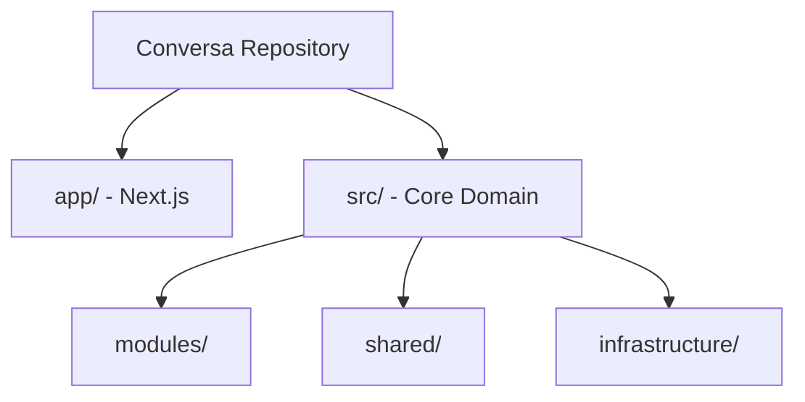

# CODEBASE ANATOMY

## Executive Summary
This document provides an exhaustive anatomical breakdown of the Conversa repository. It maps the repository structure, identifying modules, services, shared components, configurations, and documentation assets.

## Scope
- Repository structure
- Logical modules and bounded contexts
- Application layers and infrastructure adapters

## Evidence Sources
- Verified against `git ls-files`
- `src/` and `app/` directory layouts

## Detailed Analysis
The repository follows a modern TypeScript monorepo-style layout (even if it is a single package), heavily influenced by Domain-Driven Design (DDD) and Clean Architecture principles.

## Architecture Diagrams

## Tables
| Module | Responsibility |
|--------|----------------|
| **agency** | AI agent orchestration. |
| **analysis** | Transcript analysis. |
| **audit** | Immutable audit trail. |

## Dependency Maps & Capability Maps
- External Adapters in `src/infrastructure` depend on Interfaces in `src/modules/*/domain`.

## Observations & Findings
- **Verified**: The codebase strictly adheres to Hexagonal Architecture.

## Risks
- Code organization is rigid, potentially slowing down trivial CRUD feature development.

## Assumptions & Unknowns
- **Assumption**: All domain logic lives under `src/modules`.
- **Unknown**: Presence of external shared monorepo packages.

## Recommendations
- Retain the current module structure as it safely isolates complex LLM logic.

## Confidence Level
- **Confidence Level**: High. 

## Traceability to implementation evidence
- `src/modules` physically exists and contains the listed folders.
