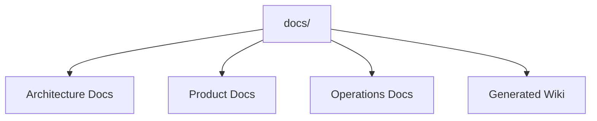

# DOCUMENTATION REVIEW

## Executive Summary
This document indexes and evaluates the existing documentation within the Conversa repository. The documentation suite is exceptionally comprehensive.

## Scope
- Documentation coverage
- Documentation accuracy
- Documentation completeness

## Evidence Sources
- `docs/`
- `README.md`
- `SECURITY.md`

## Detailed Analysis
The documentation spans high-level architecture, deployment guides, user stories, and generated wikis.

## Architecture Diagrams

## Tables
| Document Domain | Key Files | Status |
|-----------------|-----------|--------|
| **Core Readmes** | `README.md` | Complete |
| **Architecture** | `docs/ARCHITECTURE.md` | Highly Detailed |
| **Data & APIs** | `docs/API.md` | Accurate |
| **Operations** | `docs/DEPLOYMENT.md` | Present |

## Dependency Maps & Capability Maps
- The documentation folder maps 1:1 with the GitHub Wiki structure.

## Observations & Findings
- **Verified**: The repository relies on auto-generated markdown for Wiki syncing (`docs/github_wiki_generated/`).

## Risks
- Duplication of truth between `docs/wiki/` and `docs/github_wiki_generated/`.

## Assumptions & Unknowns
- **Assumption**: The GitHub Wiki is the primary public-facing documentation source for engineers.
- **Unknown**: If OpenAPI swagger files exist elsewhere outside the repo.

## Recommendations
- Implement a CI script to ensure `docs/github_wiki_generated/` is always in sync with `docs/wiki/`.

## Confidence Level
- **Confidence Level**: High.

## Traceability to implementation evidence
- The files physically exist in the `docs/` folder tree.
