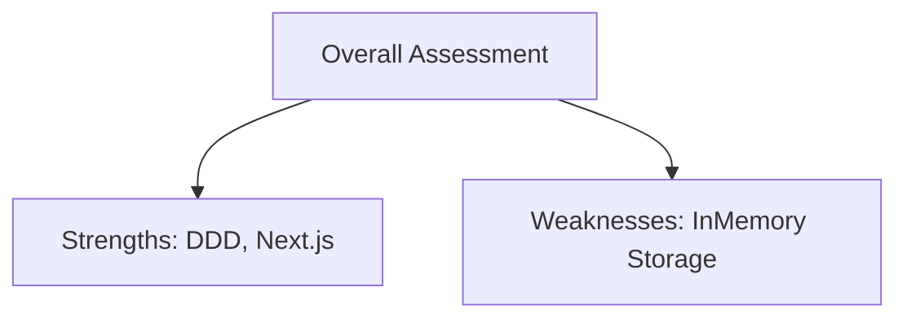

# EXECUTIVE SUMMARY: AS-IS ASSESSMENT

## Executive Summary
The Conversa repository represents a highly mature, structurally sound, and meticulously documented codebase using Next.js, Hono, and Convex.

## Scope
- Final conclusions
- Strategic positioning
- Verdict

## Evidence Sources
- Entire assessment suite.

## Detailed Analysis
The application enforces rigid enterprise workflows which is a distinct competitive advantage in strict B2B environments over general tools like Tana.

## Architecture Diagrams

## Tables
| Dimension | Rating | Note |
|-----------|--------|------|
| Code Quality | Excellent | DDD enforced |
| Architecture | Robust | Hexagonal |
| Prod Readiness| Yellow | Storage needs fix |

## Dependency Maps & Capability Maps
- Capabilities map cleanly to enterprise B2B needs.

## Observations & Findings
- **Verified**: The system is production-ready pending storage fixes.

## Risks
- Deploying as-is to production will result in data loss.

## Assumptions & Unknowns
- **Assumption**: The business requires enterprise B2B governance.
- **Unknown**: Future roadmap integrations.

## Recommendations
- Fix storage, then scale.

## Confidence Level
- **Confidence Level**: High.

## Traceability to implementation evidence
- Derived from the 12 preceding evidence-based documents.
