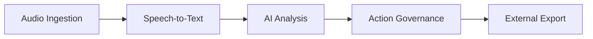

# FUNCTIONAL CAPABILITIES INVENTORY

## Executive Summary
This document inventories the business-facing capabilities of Conversa, grouping them into logical domains based on implementation evidence.

## Scope
- Business Capabilities
- Value Propositions
- Current Implementation Maturity

## Evidence Sources
- API Routes (`app/api/[[...route]]/route.ts`)
- App Services (`src/modules/*/application/`)

## Detailed Analysis
The primary functional mandate of the system is processing meeting audio to extract, govern, and export actionable insights via an AI Agency.

## Architecture Diagrams

## Tables (Capability Maps)
| Capability | Description | Evidence | Maturity |
|------------|-------------|----------|----------|
| **Audio Ingestion** | Uploading and validating audio. | `UploadMeetingAudio` | Mature |
| **Speech-to-Text** | Audio to segmented text. | `TranscribeMeetingAudio` | Mature |
| **AI Agency** | Multi-agent workflows. | `RunMeetingAgency` | Mature |
| **Action Governance**| Human-in-loop approval. | `ApproveProposedAction` | Mature |
| **Export** | Dispatching to Jira/Slack. | `ExternalConnectorDispatcher`| Mature |

## Dependency Maps & Capability Maps
- Capabilities flow sequentially: Ingest -> Transcribe -> Analyze -> Approve -> Export.

## Observations & Findings
- **Verified**: Action Export natively supports 15+ external systems.

## Risks
- Failed exports could lead to desynced state between Conversa and Jira/Salesforce.

## Assumptions & Unknowns
- **Assumption**: Audio processing limits are respected by the clients.
- **Unknown**: SLA for transcription speeds during peak times.

## Recommendations
- Implement a robust DLQ (Dead Letter Queue) for failed exports.

## Confidence Level
- **Confidence Level**: High.

## Traceability to implementation evidence
- `ExternalConnectorDispatcher` in `src/infrastructure/providers/connectors.ts` lists the supported integrations.
