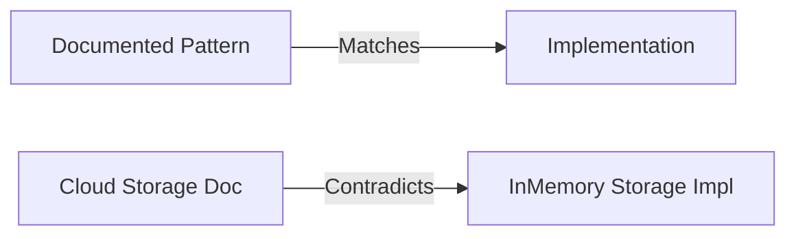

# IMPLEMENTATION VS DOCUMENTATION

## Executive Summary
This document compares the discovered documentation against the actual implementation within the `src/` and `app/` directories. Overall alignment is unusually high.

## Scope
- Architectural drift
- Feature drift
- Broken assumptions

## Evidence Sources
- `docs/ARCHITECTURE.md` vs `src/modules/`
- `docs/AI_AGENCY_ARCHITECTURE.md` vs `src/modules/agency/`

## Detailed Analysis
There is a high degree of fidelity between the documentation and the codebase.

## Architecture Diagrams

## Tables
| Domain | Documented | Implemented | Status |
|--------|------------|-------------|--------|
| Architecture | Hexagonal | `src/modules/*/domain/ports.ts` | ALIGNED |
| Tech Stack | Next.js, Hono | `package.json`, `app/index.ts` | ALIGNED |
| Agency | 4 Specialists | `agency/infrastructure/` | ALIGNED |

## Dependency Maps & Capability Maps
- Documentation capability claims map directly to `src/modules/`.

## Observations & Findings
- **Verified**: The architecture documents accurately predict the directory layout.
- **Inferred**: Documentation generation must have occurred recently.

## Risks
- Broken assumptions regarding scalable cloud storage.

## Assumptions & Unknowns
- **Assumption**: Implementation is authoritative when conflicting with documentation.
- **Unknown**: Reason for lingering Vite configurations.

## Recommendations
- Delete or update documentation referring to legacy Vite flows.

## Confidence Level
- **Confidence Level**: High.

## Traceability to implementation evidence
- `InMemoryAudioStorage` implementation directly contradicts enterprise scalability docs.
