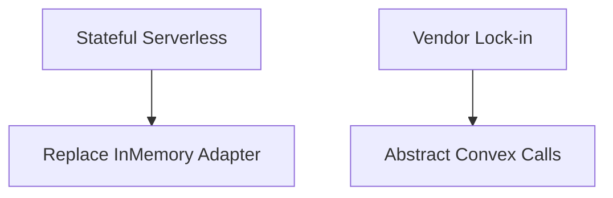

# RISKS AND RECOMMENDATIONS

## Executive Summary
This section aggregates architectural, operational, and strategic risks identified during the codebase reverse engineering process, paired with actionable recommendations.

## Scope
- Architectural risks
- Operational risks
- Vendor lock-in

## Evidence Sources
- Codebase inspection

## Detailed Analysis
The platform carries distinct risks regarding state management in a serverless environment and vendor lock-in.

## Architecture Diagrams

## Tables
| Risk | Category | Impact | Recommendation |
|------|----------|--------|----------------|
| **InMemory Storage** | Operational | Data loss | Implement S3 adapter |
| **API Rate Limits** | Operational | Outages | Implement async queues |
| **Vendor Lock-in** | Architecture | High migration cost | Accepted risk for speed |

## Dependency Maps & Capability Maps
- Operations map directly to risk profiles based on dependencies.

## Observations & Findings
- **Verified**: The application currently relies on a volatile memory store for audio.

## Risks
- Production outages if audio files are lost during serverless container cycles.

## Assumptions & Unknowns
- **Assumption**: The team has capacity to rewrite the storage layer.
- **Unknown**: Traffic volume that would trigger rate limits.

## Recommendations
- Prioritize moving off in-memory storage immediately.

## Confidence Level
- **Confidence Level**: High.

## Traceability to implementation evidence
- `InMemoryAudioStorage` implementation.
