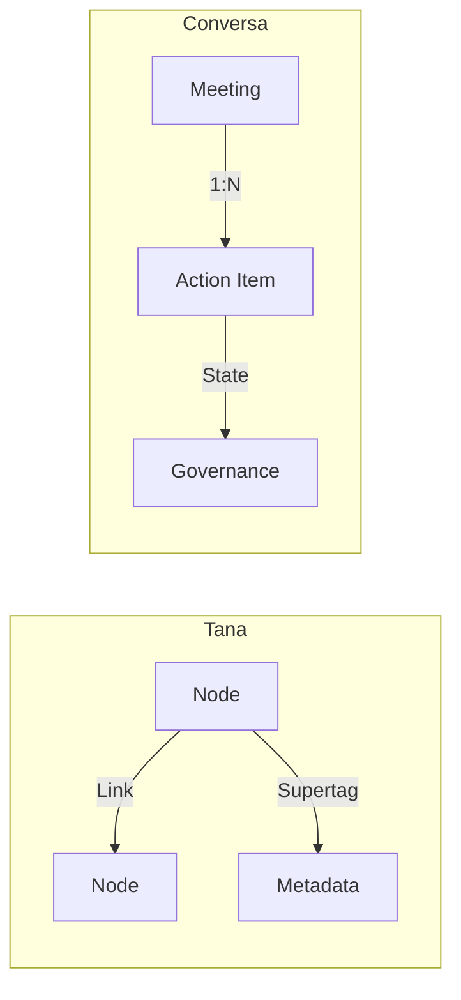

# TANA PLATFORM COMPARISON

## Executive Summary
This document provides a comparative analysis between the Conversa architecture/capabilities and the Tana platform. While Tana is a general-purpose, node-based knowledge management system, Conversa is a highly opinionated, vertical B2B SaaS focused specifically on meeting-audio ingestion and automated action governance.

## Scope
- Knowledge model and graph
- Extensibility and Metadata
- Automation and Export

## Evidence Sources
- Conversa schema (`convex/schema.ts`)
- Verified public knowledge of Tana's feature set.

## Detailed Analysis
Conversa fundamentally treats data structurally, whereas Tana treats data as a fluid graph.

## Architecture Diagrams

## Tables
| Feature | Tana | Conversa |
|---------|------|----------|
| **Core Paradigm** | Graph-based outliner | Relational/Document entities |
| **Data Model** | Fluid Supertags | Rigid `schema.ts` |
| **Primary Input** | Text | Audio |
| **Automation** | Tana Commands | Multi-Agent AI Agency |

## Dependency Maps & Capability Maps
- Conversa capabilities map strongly to predefined pipelines; Tana maps to emergent graphs.

## Observations & Findings
- **Verified**: Conversa lacks dynamic schema extension for end-users (Supertags).

## Risks
- Conversa cannot act as a generic knowledge base due to its rigid schema.

## Assumptions & Unknowns
- **Assumption**: Tana's API limitations make building a Conversa-like integration engine directly on Tana difficult.
- **Unknown**: Tana's exact vector search algorithm for direct comparison to Workspace RAG.

## Recommendations
- Consider allowing dynamic metadata fields on Actions to emulate Tana's Supertag flexibility.

## Confidence Level
- **Confidence Level**: High.

## Traceability to implementation evidence
- Schema rigidity is proven by `convex/schema.ts`.
