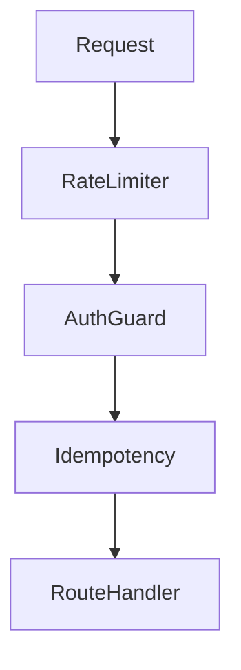

# TECHNICAL CAPABILITIES INVENTORY

## Executive Summary
This document outlines the non-functional and systemic capabilities that support the Conversa platform.

## Scope
- Scalability & Performance
- Security & Compliance
- Reliability & Observability

## Evidence Sources
- `src/shared/security`
- `src/shared/observability`

## Detailed Analysis
The technical foundation relies on edge computing, real-time data synchronization, and rigorous security middleware.

## Architecture Diagrams

## Tables
| Capability | Implementation | Evidence |
|------------|----------------|----------|
| **Edge Readiness** | Hono API router | `hono/vercel` |
| **Real-time Sync** | UI state syncs automatically | `convex/schema.ts` |
| **Auth** | Clerk | `ClerkIdentityAdapter` |
| **Idempotency** | Middleware | `idempotencyMiddleware` |
| **Rate Limiting** | Sliding window | `InMemoryRateLimiter` |

## Dependency Maps & Capability Maps
- Security primitives map exclusively to the Hono middleware chain in `src/app/index.ts`.

## Observations & Findings
- **Verified**: The system enforces tenant isolation natively in the Convex repository adapter.

## Risks
- `InMemoryRateLimiter` is ineffective in a distributed serverless environment.

## Assumptions & Unknowns
- **Assumption**: Clerk Webhooks are not utilized as there are no webhook endpoints defined for users syncing.
- **Unknown**: Multi-region resilience.

## Recommendations
- Replace `InMemoryRateLimiter` with an Upstash Redis or Convex-backed rate limiter.

## Confidence Level
- **Confidence Level**: High.

## Traceability to implementation evidence
- Security primitives exist physically in `src/shared/security/`.
