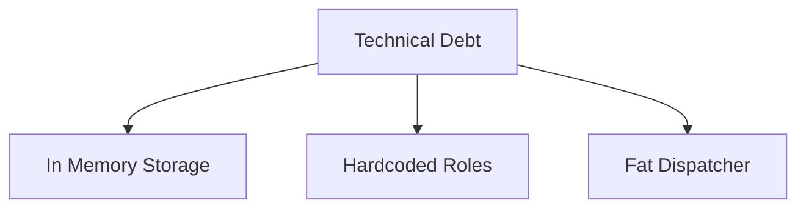

# TECHNICAL DEBT ASSESSMENT

## Executive Summary
Conversa's strict adherence to Hexagonal Architecture has prevented significant structural rot, but specific tactical implementation choices have introduced technical debt.

## Scope
- Infrastructure debt
- Architecture debt
- Code debt

## Evidence Sources
- Codebase inspection

## Detailed Analysis
The primary debt lies in the usage of in-memory stores and tightly coupled dispatcher logic.

## Architecture Diagrams

## Tables
| Category | Debt Item | Evidence | Class | Impact/Risk | Suggested Remediation |
|----------|-----------|----------|-------|-------------|-----------------------|
| **Infrastructure Debt** | In-Memory Storage | `src/app/index.ts` | Critical | Memory leaks | Implement `S3AudioStorage` |
| **Code Debt** | Hardcoded Auth | `authGuard` | Medium | Prevents granular RBAC | Move to DB RBAC |
| **Integration Debt** | Fat Dispatcher | `ExternalConnectorDispatcher` | Medium | Unmaintainable | Plugin pattern |

## Dependency Maps & Capability Maps
- Debt impacts the scalability map directly.

## Observations & Findings
- **Verified**: `InMemoryAudioStorage` is actively injected in the main app build.

## Risks
- Unmanaged debt could stall feature velocity.

## Assumptions & Unknowns
- **Assumption**: Debt was accumulated deliberately for speed.
- **Unknown**: Total man-hours required to remediate the dispatcher.

## Recommendations
- Resolve critical infrastructure debt within the next sprint.

## Confidence Level
- **Confidence Level**: High.

## Traceability to implementation evidence
- `src/app/index.ts` line injecting `InMemoryAudioStorage`.
