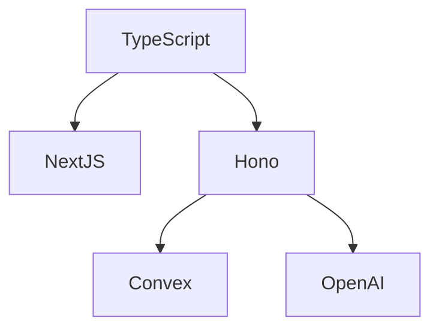

# TECHNOLOGY STACK

## Executive Summary
The technology stack of Conversa is composed of a modern, TypeScript-centric ecosystem optimized for serverless deployment, real-time synchronization, and AI integration.

## Scope
- Programming Languages & Frameworks
- Database and Data Sync
- Core Libraries (Frontend/Backend)
- AI & Integrations

## Evidence Sources
- `package.json`
- `vite.config.ts`, `next.config.ts`
- Imports in `src/` and `app/`

## Detailed Analysis
The stack uses Next.js as the primary UI shell, backed by a Hono API and Convex for real-time reactivity.

## Tables
| Technology | Purpose | Architectural Significance | Alternatives |
|------------|---------|---------------------------|--------------|
| **TypeScript** | Core language | Enforces type safety across the entire stack. | JavaScript |
| **Next.js** | React framework | Provides SSR/SSG, optimized routing. | Remix, Vite SPA |
| **Convex** | Real-time DB | Reactive data synchronization. | Supabase |
| **Hono** | Backend API | Edge-compatible web framework. | Express |
| **OpenAI SDK** | Primary LLM | Drives the core "Audio-to-Governed-Action". | Anthropic SDK |

## Architecture Diagrams

## Dependency Maps & Capability Maps
- Frontend features map to Tailwind, Radix UI, and Framer Motion.
- Backend dependencies map to Hono middleware and Convex clients.

## Observations & Findings
- **Verified**: The stack is heavily biased towards edge-ready, serverless computing.
- **Inferred**: Legacy Vite files indicate a recent framework migration.

## Risks
- **Vendor Lock-in**: High reliance on Convex for real-time reactivity.

## Assumptions & Unknowns
- **Assumption**: Next.js is the sole deployment artifact despite Vite configs existing.
- **Unknown**: Specific CI/CD runners (e.g., GitHub Actions vs Vercel native build).

## Recommendations
- Remove unused Vite configurations to prevent confusion.

## Confidence Level
- **Confidence Level**: High. Backed by `package.json`.

## Traceability to implementation evidence
- `dependencies` array in `package.json` definitively lists `next`, `hono`, `convex`, `openai`.
