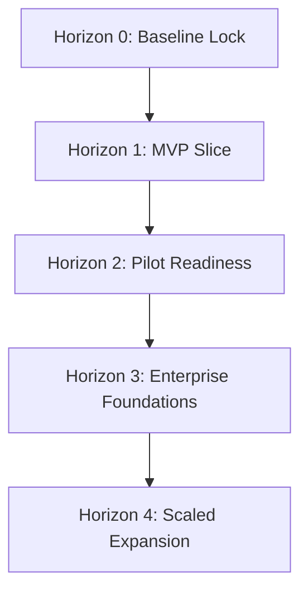

# Canonical Product Roadmap

This document serves as the single source of truth for the development, verification, and scaling roadmap of Conversa.

---

## 1. Executive Summary

Conversa is an audio-first meeting intelligence platform that translates spoken conversations into structured, governed, and traceable work outcomes. This roadmap provides an evidence-based pathway transitioning Conversa from its current verified, in-memory MVP baseline to a production-ready, multi-tenant enterprise platform.

---

## 2. Product Goal & North Star

> **Product North Star:** Turn meeting conversations into governed, traceable, and completed work.

### Near-Term Demonstration Goal (Horizon 1)
A user can submit a meeting transcript, the Meeting Manager dynamically plans the analysis, specialists extract structured findings (actions, decisions, risks), QA validates or revises outputs, ambiguous cases escalate, findings are persisted in real-time, and a grounded action digest reaches Slack with a link to an inspectable run trace.

### Productization Goal (Horizon 2+)
A design partner can repeatedly execute the workflow with cryptographically secured tenant boundaries, live database persistence, and robust operational error handling.

---

## 3. Verified Current State

As of July 12, 2026, the Conversa core agent and API framework is verified at **91.6% MVP readiness**:
- **Total Automated Tests:** 76/76 passing (Unit: 30/30, Integration: 33/33, E2E: 13/13).
- **Adversarial Scenarios:** 7/7 passing in integration testing.
- **Automated Quality Evaluation:** `npm run eval:agency` passes with a 93.3% Action Recall score.
- **AI-as-Agency Rubric Score:** **137 / 164** (Agent Organization: L4/20, Observability: L4/28, Usability UI: L4/4).
- **Architecture:** Monolithic Hono API backend with an in-memory repository architecture and a Vanilla TS Vite Single Page App.

*Note: The previously documented four-hour Next.js Vercel transcription MVP is obsolete. Hono/Vite on Cloudflare is the current canonical stack.*

---

## 4. The Five Roadmap Horizons

### Horizon 0 — Baseline Lock and Documentation Reconciliation
- **Objective:** Freeze the verified agency baseline and resolve documentation drift.
- **Key Initiatives:**
  - Create continuous integration gates to run evaluations on every PR.
  - Reconcile obsolete Next.js documentation in the wiki to point to Hono/Vite.
  - Establish a capability status taxonomy.
- **Entry Criteria:** Passing local test suites (76 tests) and passing evaluation script (`run-eval.ts`).
- **Exit Criteria:** Automated GitHub Actions pipeline is active; all outdated documentation is updated/marked.

### Horizon 1 — MVP-Complete Vertical Slice
- **Objective:** Deliver one repeatable, demonstrable, externally hosted end-to-end workflow on Cloudflare Pages and Workers.
- **Key Initiatives:**
  - **Convex Persistence:** Migrate transient memory repositories to reactive Convex database tables.
  - **Waitlist Page:** Live Headline + Email input waitlist page.
  - **Linkup Grounding:** Integrate Linkup search client to attach source links to meeting findings.
  - **Slack Integration:** Send meeting action digests directly to real Slack channels.
  - **Daily Scheduler:** Configure an 8:00 AM cron to trigger sweeps.
- **Entry Criteria:** Horizon 0 exit.
- **Exit Criteria:**
  - Vite client and Hono server running on Cloudflare.
  - Meeting digests post to Slack containing Linkup evidence links.
  - Execution runs are persisted in Convex and visible in the Trace UI.

### Horizon 2 — Design-Partner Pilot Readiness
- **Objective:** Secure the platform and make it safe for 3–5 early design partners.
- **Key Initiatives:**
  - **Cryptographic Auth:** Integrate Clerk/JWT signature verification in Hono middleware.
  - **Idempotent Connectors:** Guarantee retry and timeout safety.
  - **Product Analytics:** Integrate usage tracking (approvals, overrides, rejections).
  - **Onboarding Admin:** Basic tenant configuration UI.
- **Entry Criteria:** Horizon 1 exit.
- **Exit Criteria:**
  - At least 3 active design partners executing the workflow.
  - No cross-tenant scope leaks verified under automated penetration scans.

### Horizon 3 — Reliability and Enterprise Foundations
- **Objective:** Prepare the system architecture for broader corporate adoption.
- **Key Initiatives:**
  - **Tamper-Evident Audit:** Immutable storage for audit event logs.
  - **Model Failover:** Degraded mode execution (e.g. routing to Anthropic if OpenAI fails).
  - **Resilience Testing:** High-load simulations and automated disaster-recovery runs.
  - **Compliance Evidence:** Threat model validation.
- **Entry Criteria:** Horizon 2 exit.
- **Exit Criteria:** Uptime SLA > 99.9%; automated security regression test suites merged into CI pipeline.

### Horizon 4 — Scaled Product and Platform Expansion
- **Objective:** Expand the feature scope based on commercial feedback and metrics.
- **Conditional Initiatives:**
  - Real-time streaming audio ingestion.
  - Additional downstream connectors (Jira, Salesforce, GitHub).
  - Workspace-level memory and RAG knowledge graphs.
- **Promotion Criterion:** Must be backed by explicit client demand, positive commercial value, and operational capacity.

---

## 5. Explicit Exclusions (Out of Scope)
- **No Video Processing:** Video uploads will return `415 UNSUPPORTED_MEDIA_TYPE` (per ADR 0002).
- **No Custom Auth UI:** Horizon 1 and 2 will utilize prebuilt Clerk/Auth0 authentication widgets only.
- **No Multi-Model Routing in Horizon 1:** Horizon 1 is locked to a single model provider (OpenAI GPT-4o or equivalent mock).

---

## 6. Known Risks & Mitigations
1. **Model API Rate Limits:** Mitigated by implementing token buckets, request retries, and local mock fallback modes.
2. **Infinite Revision Loops:** Mitigated by enforcing a strict maximum threshold of 1 automatic retry in [run-meeting-agency.ts](file:///c:/Users/rajaj/Projects/1_Conversa/src/modules/agency/application/run-meeting-agency.ts) before escalating to a human administrator.
3. **Data Loss:** Mitigated by migrating to Convex persistent document memory in Horizon 1.
