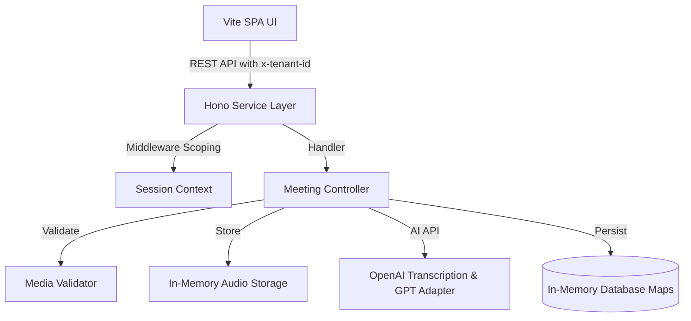

# Architecture

> **Current-state notice:** Conversa is an active MVP prototype containing experimental, incomplete, mocked, and recently remediated functionality. It is not approved for production use, confidential meetings, regulated data, or uncontrolled multi-tenant deployment.

Conversa is structured as a decoupled Hono REST service backend and a Vite Single Page Application (SPA) frontend.

## Block Diagram

## System Components

1. **Hono Web Server**: Serves routes for health checks, meetings, action items, and audit logs.
2. **Vite SPA Frontend**: The single-page client. Communicates via standard fetch calls.
3. **Repository Layer**: Abstracted using interfaces. Concrete implementations use in-memory Map arrays.
4. **Validation Pipeline**: Verifies file formats (refuses video, limits size to 10MB) and ensures input transcripts are populated.
5. **Logger Pipeline**: Intercepts console logging. Redacts sensitive credentials recursively up to 10 levels deep.
