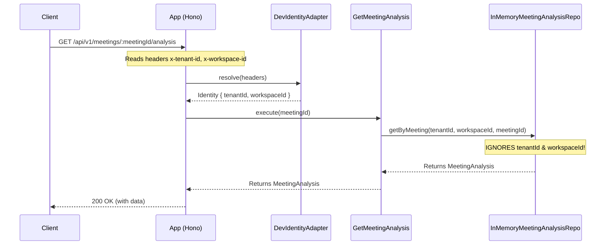
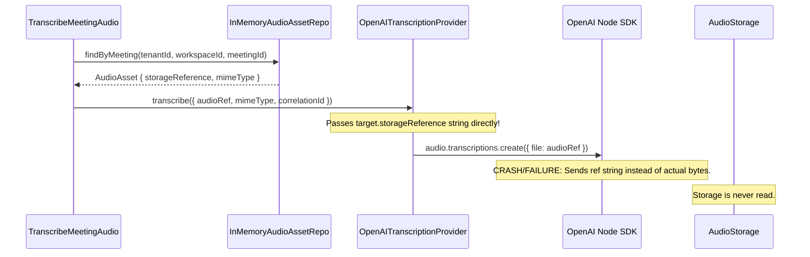

# Security Audit Baseline

This document establishes the baseline of the Conversa audio-first meeting-orchestration repository under review for the independent security remediation verification.

## Audited Environment & Scope

* **Branch Under Audit**: `ANTIGRAVITY_EIGHTHGATE/security-remediation-audit` (derived from `HERMES_SEVENTHGATE/product-analytics` / `HERMES_FOURTHGATE/ai-evaluation-benchmark`)
* **Audited Commit**: `dd7d984` ("test-docs: add meeting analysis evaluation benchmark")
* **Repository Status**: Switched to a dedicated verification work branch. The working copy contains the implementation agent's proposed remediation code changes (15 modified files, multiple untracked files).
* **Inspected Paths**:
  * [src/modules/](file:///c:/Users/rajaj/Projects/1_Conversa/src/modules/)
  * [src/infrastructure/](file:///c:/Users/rajaj/Projects/1_Conversa/src/infrastructure/)
  * [src/shared/](file:///c:/Users/rajaj/Projects/1_Conversa/src/shared/)
  * [src/app/](file:///c:/Users/rajaj/Projects/1_Conversa/src/app/)
  * [tests/](file:///c:/Users/rajaj/Projects/1_Conversa/tests/)
  * [docs/adr/](file:///c:/Users/rajaj/Projects/1_Conversa/docs/adr/)
  * [docs/stabilization-report.md](file:///c:/Users/rajaj/Projects/1_Conversa/docs/stabilization-report.md)
  * [quality-artifacts/audio-governed-action/](file:///c:/Users/rajaj/Projects/1_Conversa/quality-artifacts/audio-governed-action/)

---

## Technical Context & Architectural Layout

### 1. Relevant Repository Interfaces
* **`MeetingRepo`**: Declares `save`, `get`, `listByScope`. Enforces `tenantId` and `workspaceId` parameters on `get` and `listByScope`.
* **`AudioAssetRepo`**: Declares `save`, `get`, `findByChecksum`, `findByMeeting`. Enforces `tenantId` and `workspaceId` on reads.
* **`TranscriptRepo`**: Declares `save`, `get`, `findByMeeting`. Enforces `tenantId` and `workspaceId` on reads.
* **`AnalysisRunRepo`**: Declares `save`, `get`, `findByMeeting`, `findByIdempotencyKey`. Enforces `tenantId` and `workspaceId` on `get` and `findByMeeting`.
* **`MeetingAnalysisRepo`**: Declares `save`, `getByMeeting`, `getByRun`, `saveDecision`, `saveAction`, `getAction`, `updateAction`, `saveApproval`, `listActionsByMeeting`.
* **`AuditRepo`**: Declares `append` and `listByMeeting`.

### 2. Relevant Implementations
* **`InMemoryMeetingRepo`**: Filters items using a helper function `scopeMatch(item, tenantId, workspaceId)`.
* **`InMemoryAudioAssetRepo`**: Enforces `scopeMatch` checks for `get`, `findByChecksum`, and `findByMeeting`.
* **`InMemoryTranscriptRepo`**: Enforces `scopeMatch` checks for `get` and `findByMeeting`.
* **`InMemoryAnalysisRunRepo`**: Enforces `scopeMatch` checks on `get` and `findByMeeting`, but `findByIdempotencyKey` bypasses tenant/workspace scope parameters.
* **`InMemoryMeetingAnalysisRepo`**: Implements memory-backed tables but **completely ignores** `tenantId` and `workspaceId` parameters in `getByMeeting`, `getAction`, and `listActionsByMeeting`.
* **`InMemoryAuditRepo`**: Correctly checks `scopeMatch` when returning lists of audit events.

---

## System Flows

### 1. Route-to-Use-Case-to-Repository Flow

The application is built on **Hono** routing. The following diagram maps an incoming HTTP request (e.g., retrieving meeting analysis) to database operations:

### 2. Provider-to-Storage Flow (Transcription)

The following diagram maps the flow of data during the audio transcription process:

### 3. Logger Runtime Dependencies
The logging engine (`ConsoleLogger` in [logger.ts](file:///c:/Users/rajaj/Projects/1_Conversa/src/shared/logging/logger.ts)) depends directly on Node.js-only modules:
* `process.stdout.write` is invoked directly on each write call.
* It does not fallback or handle environments where `process` or `process.stdout` is undefined (e.g. browser bundles or standard Cloudflare Workers isolates).

---

## Verification Assertions & Evidence Taxonomy

To ensure the integrity of the findings, the observations are categorized as follows:

### Verified Facts
* `InMemoryMeetingAnalysisRepo` completely omits `tenantId` and `workspaceId` validation checks in `getByMeeting`, `getAction`, and `listActionsByMeeting`.
* `OpenAITranscriptionProvider` does not retrieve bytes from `AudioStorage` and passes the plain storage reference string (e.g. `"tenants/demo/workspaces/demo/media/<uuid>"`) directly to the OpenAI SDK's transcription method.
* `ConsoleLogger` uses `process.stdout.write` for all log outputs.
* `redact` logic in `redaction.ts` performs a shallow check on the keys of the logged object, which fails to protect against leaks in nested properties.

### Inferred Behavior
* Swapping the headers `x-tenant-id` and `x-workspace-id` on requests that invoke repository calls without `scopeMatch` controls will succeed, resulting in cross-tenant data leaks (IDOR).
* Deploying the active app bundle directly into a browser environment (Vite dev server) or a standard Cloudflare Worker will crash the process due to `process.stdout` being undefined.

### Unverified Assumptions
* It is assumed that the production deployment environment enforces authentication upstream to sanitize/reject manual overrides of `x-tenant-id` and `x-workspace-id` headers, as the active code has no token signature or validation check in the resolved identity context.
